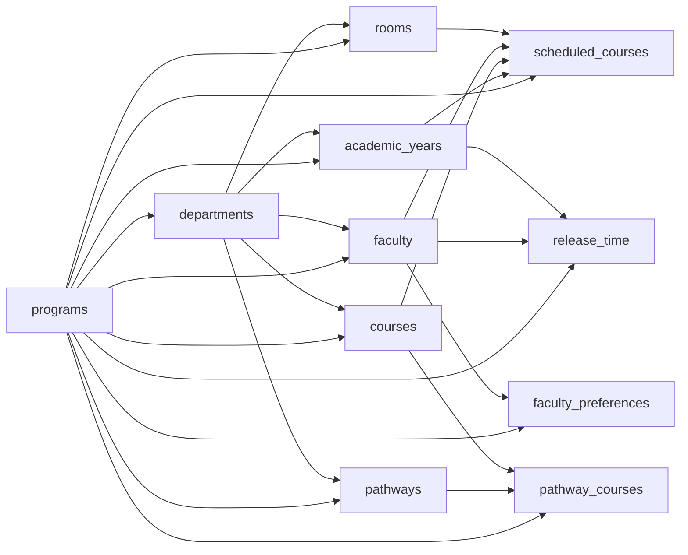

# Multi-Tenant Schema Design (T-01)

Issue: [#99](https://github.com/sicxz/program-command/issues/99)  
Parent epic: [#98](https://github.com/sicxz/program-command/issues/98)

## Goals
- Introduce a first-class `programs` table for tenant identity and profile config.
- Add direct `program_id` scoping to all program-owned data tables.
- Define FK/index strategy so RLS can filter by `program_id` efficiently.
- Choose one canonical source for "current program" in SQL policy evaluation.

## Decision Summary
- **Current program context source:** **Option A (JWT claim)** via `app_metadata.program_id`.
- **Canonical tenant key:** `programs.id` (`uuid`).
- **Policy model:** every scoped table gets `program_id uuid not null references programs(id)`.
- **Admin bypass:** platform admins can bypass program filter in RLS.

Reasoning for Option A:
- Aligns with Supabase-native auth + RLS model already in use.
- Avoids per-request session mutation (`set_config`) from the browser.
- Keeps client and SQL policy behavior deterministic for normal app traffic.

## Proposed `programs` Table

```sql
create table if not exists public.programs (
  id uuid primary key default gen_random_uuid(),
  name text not null,
  code text not null unique,
  config jsonb not null default '{}'::jsonb,
  created_by uuid references auth.users(id),
  created_at timestamptz not null default now(),
  updated_at timestamptz not null default now()
);

create index if not exists idx_programs_created_by on public.programs(created_by);
```

`config` JSON shape (initial contract):
- `branding`: logo, primary/secondary colors, display labels.
- `academic_model`: quarter/semester mode, year labels, term windows.
- `workload_rules`: rank targets, release-time defaults, override policies.
- `constraints`: program-level scheduling defaults.

## Program-Scoped Table Inventory
All tables below hold tenant-specific data and should receive a direct `program_id` column.

| Table | Existing scope anchor | Add `program_id` | Notes |
|---|---|---|---|
| `departments` | global row keyed by `code` | yes | keep for backward compatibility; make `(program_id, code)` unique |
| `academic_years` | `department_id` | yes | unique key should become `(program_id, year)` |
| `rooms` | `department_id` | yes | unique key `(program_id, room_code)` |
| `courses` | `department_id` | yes | unique key `(program_id, code)` |
| `faculty` | `department_id` | yes | unique key `(program_id, name)` |
| `scheduled_courses` | `academic_year_id` | yes | high-volume table; add compound performance indexes |
| `faculty_preferences` | `faculty_id` | yes | maintain one row per faculty via `(program_id, faculty_id)` unique |
| `scheduling_constraints` | `department_id` | yes | common RLS read/write target |
| `release_time` | `faculty_id` + `academic_year_id` | yes | add covering index for `program_id, academic_year_id` |
| `pathways` | `department_id` | yes | RLS + lookup path |
| `pathway_courses` | `pathway_id` + `course_id` | yes | add unique `(program_id, pathway_id, course_id)` |

## FK and Integrity Strategy

### Core FK
For each scoped table:

```sql
alter table <table>
  add column if not exists program_id uuid,
  add constraint <table>_program_id_fkey
    foreign key (program_id) references public.programs(id);
```

Then backfill and enforce:

```sql
alter table <table>
  alter column program_id set not null;
```

### Cross-table consistency
To ensure child rows cannot point across programs, use composite FKs where parent relation exists:
- parent tables expose `unique (id, program_id)`.
- child tables reference both `parent_id` and `program_id`.

Example (`scheduled_courses -> academic_years`):

```sql
alter table public.academic_years
  add constraint academic_years_id_program_id_key unique (id, program_id);

alter table public.scheduled_courses
  add constraint scheduled_courses_year_program_fk
  foreign key (academic_year_id, program_id)
  references public.academic_years(id, program_id);
```

Apply similarly for:
- `rooms`, `courses`, `faculty`, `pathways` children.
- `faculty_preferences`, `release_time`, `pathway_courses` bridge tables.

## Index Strategy
Minimum required:
- `create index ... on <table>(program_id)` for every scoped table.

Recommended query-path indexes:
- `academic_years(program_id, year)`
- `scheduled_courses(program_id, academic_year_id, quarter)`
- `scheduled_courses(program_id, course_id)`
- `scheduled_courses(program_id, faculty_id)`
- `scheduled_courses(program_id, room_id)`
- `release_time(program_id, academic_year_id)`
- `pathways(program_id, type, name)`
- `pathway_courses(program_id, pathway_id)`

## Current Program Resolution (RLS)
Decision: **JWT claim based** function.

```sql
create or replace function public.current_program()
returns uuid
language sql
stable
as $$
  select nullif(auth.jwt() -> 'app_metadata' ->> 'program_id', '')::uuid;
$$;
```

Companion helper for admin bypass:

```sql
create or replace function public.is_platform_admin()
returns boolean
language sql
stable
as $$
  select coalesce(auth.jwt() -> 'app_metadata' ->> 'role', '') = 'admin';
$$;
```

RLS template (target state in T-03):

```sql
using (public.is_platform_admin() or program_id = public.current_program())
with check (public.is_platform_admin() or program_id = public.current_program())
```

## Schema Diagram



## Migration Plan Inputs for T-02
1. Create `programs` table.
2. Insert EWU Design program row (`code='ewu-design'`).
3. Add nullable `program_id` columns to scoped tables.
4. Backfill all existing rows to EWU Design program id.
5. Add indexes + composite unique keys.
6. Add/replace FKs to include `program_id` where needed.
7. Set `program_id` to `not null`.
8. Update app writes to include `program_id` in payloads.
9. Add verification queries and rollback script.

## Open Questions
- Should `departments` remain a user-facing entity or be folded into `programs` later?
- Do we require one default department per program in v1, or can a program have multiple departments?
- Should `programs.config` include explicit schema versioning (`config_version`) from day one?

## Review Checklist
- [x] `programs` table shape defined (`id`, `name`, `code`, `config`, `created_by`, `created_at`, `updated_at`).
- [x] Program-scoped table inventory captured.
- [x] FK/index strategy documented for `program_id`.
- [x] Current-program context decision recorded (Option A JWT claim selected, Option B rejected for v1).
- [x] Schema diagram and migration plan included.
