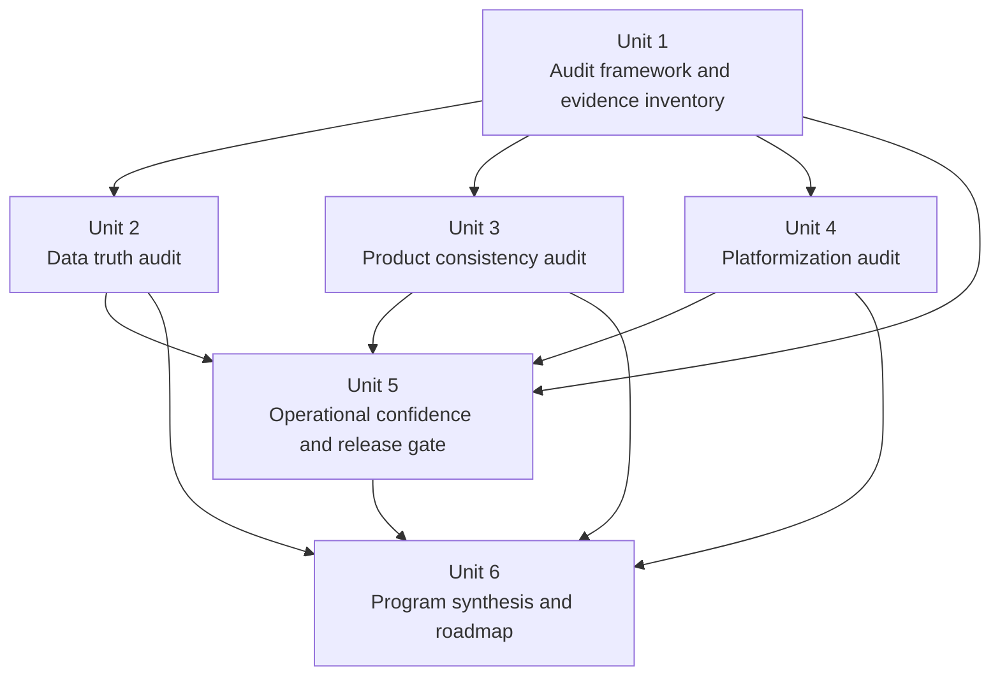

# refactor: Production readiness audit and multi-department release gate

## Overview

Build a full-product readiness program that audits the current production experience, defines a hard release gate for multi-department rollout, and turns the findings into a sequenced remediation roadmap. The output of this work is not "more notes"; it is a set of audit artifacts, evidence-backed gate criteria, and a concrete program structure that can drive later implementation without re-discovering the same platform problems.

## Problem Frame

The current codebase is already partway into multi-department and Supabase-backed work, but the runtime is still hybrid. Production-facing surfaces mix Supabase reads, local JSON files, localStorage state, embedded fallback data, and Design-first defaults. Dashboard and page styling also drift across surfaces, while onboarding and profile docs still describe a largely local, file-backed activation model. If additional departments are onboarded before those foundations are clarified, the likely result is wider inconsistency, not a reusable platform (see origin: `docs/brainstorms/2026-04-16-production-readiness-multi-department-program-requirements.md`).

This plan treats phase 1 as a full-product readiness program with four audit pillars:

| Pillar | Core question |
| --- | --- |
| Data truth | Are production-facing surfaces using canonical, trustworthy data sources? |
| Product consistency | Do pages and dashboards behave like one coherent product? |
| Platformization | Have Design-specific assumptions been removed enough to support other departments safely? |
| Operational confidence | Do docs, QA, and release checks make changes safe and repeatable for a solo builder? |

## Requirements Trace

- R1-R5. Audit the entire production product and capture evidence across runtime data paths, UI surfaces, platform assumptions, and operational practices.
- R6-R9. Organize findings under the four readiness pillars and roll them into actionable workstreams instead of an unstructured backlog.
- R10-R14. Define a hard, evidence-based release gate for multi-department rollout with explicit proof requirements.
- R15-R18. Produce a sequenced program plan that identifies major workstreams, dependencies, and readiness milestones.
- R19-R22. Publish durable documentation that becomes the reusable source of truth for the audit, gate, and follow-on work.
- R23-R25. Make phase-2 entry conditions explicit: no other-department implementation starts until all four pillars pass.

## Scope Boundaries

- This plan covers phase-1 audit and program-definition work only.
- This plan does not implement the remediation workstreams it identifies.
- This plan does not onboard a pilot department or partially start phase 2.
- This plan may introduce lightweight audit scripts and doc-backed verification checks, but it should not turn the audit into a large framework project.
- This plan does not pre-commit to a full visual-system refresh; it creates the evidence needed to decide whether the current shell can be standardized or must be replaced.

## Context & Research

### Relevant Code and Patterns

- `docs/AUDIT-ISSUES-2026-02-21.md` already captures a backlog-style audit pass and should be treated as prior art rather than replaced blindly.
- `docs/scheduler-save-contract.md` and `docs/supabase-rls-write-policy-matrix.md` show an existing pattern of contract-style docs that define canonical behavior before implementation.
- `tests/multi-tenant-schema-t01-doc.test.js` shows that this repo sometimes treats design and planning docs as contractual artifacts backed by lightweight tests.
- `docs/department-profile-schema-v1.md`, `docs/department-onboarding-qa-pack.md`, `js/department-profile.js`, `js/profile-loader.js`, `js/supabase-config.js`, and `js/db-service.js` show the current hybrid state between local profile/runtime defaults and Supabase-backed program configuration.
- `index.html`, `pages/schedule-builder.js`, `pages/constraints-dashboard.js`, `pages/recommendations-dashboard.html`, `pages/course-optimizer-dashboard.html`, `pages/release-time-dashboard.js`, `pages/workload-dashboard.js`, `js/schedule-manager.js`, and `js/data-loader.js` show widespread use of local JSON and localStorage in user-visible flows.
- `docs/ui/primer-product-ui-guidelines.md` provides the current visual-system reference point for dashboard normalization.
- `docs/dev-data-freshness.md` provides an existing environment-drift verification pattern that should inform release-gate evidence.

### Institutional Learnings

- No `docs/solutions/` library is present in this checkout, so this plan relies on current docs, contract artifacts, and live runtime files as the institutional evidence base.

### External References

- None. The repo already contains enough local evidence and adjacent contract patterns to plan this work responsibly without external research.

## Key Technical Decisions

- Treat the audit as a product artifact, not just a debugging pass: the outputs should be durable docs and verification checks that support later implementation and release decisions.
- Use one common evidence model across all four pillars so findings can be compared and rolled up cleanly into workstreams.
- Back the release gate with contract-style documentation and lightweight automated checks where possible, following the repo's existing doc-as-contract pattern.
- Resolve the plan-shape question now by including dependency order and rough phase bands, but avoid exact timelines until the audit reveals real remediation size.
- Defer the "reuse current shell vs broader refresh" decision to the audit itself; forcing that answer up front would invent product scope instead of discovering it.

## Open Questions

### Resolved During Planning

- Should the follow-on program include only sequence or also sizing? It should include dependency order plus rough phase bands, because sequencing alone is too weak for a solo-builder roadmap while exact dates would create false certainty.
- Should dashboard consistency assume the current shell is the target? No. The audit should evaluate whether the current scheduler shell is strong enough to standardize around or whether it should be replaced by a broader baseline.

### Deferred to Implementation

- Which specific production pages belong in the final "must pass" gate inventory if edge-case or legacy pages are discovered during execution? The implementing pass should finalize the exact surface list after the initial inventory is assembled.
- How much of the evidence collection can be automated safely versus maintained as curated documentation? That should be decided while building the inventory script and artifact set, based on actual signal quality.

## High-Level Technical Design

> *This illustrates the intended approach and is directional guidance for review, not implementation specification. The implementing agent should treat it as context, not code to reproduce.*

## Implementation Units

- [x] **Unit 1: Establish the audit framework and evidence inventory**

**Goal:** Create the durable audit workspace, define the evidence model, and add a lightweight inventory check so later audit documents are grounded in repeatable repo evidence instead of ad hoc notes.

**Requirements:** R1, R2, R6, R7, R19

**Dependencies:** None

**Files:**
- Create: `docs/audits/README.md`
- Create: `docs/audits/production-surface-inventory.md`
- Create: `docs/audits/audit-evidence-model.md`
- Create: `scripts/audit-runtime-dependencies.js`
- Create: `tests/audit-runtime-dependencies.test.js`

**Approach:**
- Define the inventory format for production surfaces, including page or module name, owner surface, data inputs, fallback behaviors, storage assumptions, and whether the surface is in the future release gate.
- Keep the script intentionally small: it should inventory known classes of risk such as local JSON fetches, localStorage persistence, embedded fallbacks, and Design-specific profile defaults in key runtime files.
- Use the script as evidence support, not as the sole source of truth; the docs remain authoritative, while the script prevents obvious blind spots.

**Execution note:** Start characterization-first. The first pass should describe the current state faithfully before recommending any remediation.

**Patterns to follow:**
- `docs/AUDIT-ISSUES-2026-02-21.md`
- `tests/multi-tenant-schema-t01-doc.test.js`

**Test scenarios:**
- Happy path — scanning `index.html`, `js/supabase-config.js`, and `pages/schedule-builder.js` reports local JSON fetches, localStorage usage, and fallback markers in a structured output.
- Edge case — files without matching patterns return empty result sets rather than malformed entries.
- Error path — unreadable or missing file paths are reported as explicit scan failures instead of silently disappearing from the report.
- Integration — the production surface inventory doc and the script target list stay aligned, so every audited production surface has either automated scan coverage or an explicit "manual only" note.

**Verification:**
- `docs/audits/README.md` explains the audit artifact set and evidence flow.
- `docs/audits/production-surface-inventory.md` lists the production surfaces under review.
- `scripts/audit-runtime-dependencies.js` can inventory the targeted files and `tests/audit-runtime-dependencies.test.js` protects its output shape.

- [x] **Unit 2: Audit data truth and define the production source-of-truth policy**

**Goal:** Produce the canonical view of where user-visible data comes from today, where it should come from, and what fallback behavior is acceptable or forbidden in production paths.

**Requirements:** R1, R2, R6-R9, R12-R14, R21, R25

**Dependencies:** Unit 1

**Files:**
- Create: `docs/audits/data-truth-audit.md`
- Create: `docs/audits/production-source-of-truth-policy.md`
- Modify: `docs/dev-data-freshness.md`
- Modify: `docs/scheduler-save-contract.md`
- Create: `tests/data-truth-audit-doc.test.js`

**Approach:**
- Map every production-facing data flow to one of these classes: canonical DB-backed, acceptable local draft state, legacy fallback, or unknown.
- Explicitly separate tolerable client-side draft persistence from disallowed production fallback data so the audit does not over-correct legitimate draft workflows.
- Use existing drift and contract docs as anchors rather than creating a separate vocabulary for data readiness.
- Capture a proof model for the gate, such as inventory evidence, drift checks, and contract assertions, so "data truth passed" is auditable.

**Patterns to follow:**
- `docs/dev-data-freshness.md`
- `docs/scheduler-save-contract.md`
- `docs/supabase-rls-write-policy-matrix.md`

**Test scenarios:**
- Happy path — the doc test verifies the audit names all required source classes and includes a decision for each production surface category.
- Edge case — the policy explicitly distinguishes allowed local draft state from banned embedded fallback data on production paths.
- Error path — the audit captures "unknown or mixed source" as a finding type instead of forcing a false canonical answer.
- Integration — the source-of-truth policy references existing verification mechanisms such as environment drift checks and save-contract invariants.

**Verification:**
- `docs/audits/data-truth-audit.md` contains a complete data-source matrix and blocking findings.
- `docs/audits/production-source-of-truth-policy.md` defines acceptable and unacceptable runtime data patterns.
- `tests/data-truth-audit-doc.test.js` enforces the required sections and gate evidence fields.

- [x] **Unit 3: Audit product consistency and define the dashboard shell baseline**

**Goal:** Produce a product-wide view of dashboard and page consistency, then define the baseline shell and style expectations that future remediation must normalize toward.

**Requirements:** R1, R4, R6-R9, R15-R17, R20

**Dependencies:** Unit 1

**Files:**
- Create: `docs/audits/product-consistency-audit.md`
- Create: `docs/audits/dashboard-shell-baseline.md`
- Modify: `docs/ui/primer-product-ui-guidelines.md`
- Create: `tests/product-consistency-audit-doc.test.js`

**Approach:**
- Inventory each user-facing production surface against a consistent rubric: shell structure, navigation, typography, state handling, action hierarchy, empty states, and visual status language.
- Do not collapse the audit into "good or bad styling." Capture whether the inconsistency is cosmetic drift, workflow friction, or a blocker to multi-department credibility.
- Use the audit to answer a specific question: can the current scheduler shell serve as the standard, or does the repo need a broader shell reset before standardization?

**Patterns to follow:**
- `docs/ui/primer-product-ui-guidelines.md`
- `pages/workload-dashboard.js`
- `pages/recommendations-dashboard.html`

**Test scenarios:**
- Happy path — the doc test verifies every audited production surface is classified against the same consistency rubric.
- Edge case — the baseline allows page-specific density differences without excusing broken navigation, inconsistent status semantics, or shell fragmentation.
- Error path — the audit records surfaces that cannot yet be judged because they are incomplete or legacy, rather than silently excluding them.
- Integration — the baseline doc ties visual expectations back to the audited surfaces and names the conditions that would trigger a broader shell refresh recommendation.

**Verification:**
- `docs/audits/product-consistency-audit.md` groups findings by recurring product-pattern problems rather than only by page.
- `docs/audits/dashboard-shell-baseline.md` defines the normalization target and decision criteria.
- `tests/product-consistency-audit-doc.test.js` protects the required rubric and surface coverage.

- [x] **Unit 4: Audit platformization blockers for multi-department reuse**

**Goal:** Identify every Design-first assumption or single-department shortcut that would prevent a safe transition from one-department product to reusable multi-department platform.

**Requirements:** R1, R3, R6-R9, R15-R18, R22, R24-R25

**Dependencies:** Unit 1

**Files:**
- Create: `docs/audits/platformization-audit.md`
- Create: `docs/audits/multi-department-blockers.md`
- Modify: `docs/department-profile-schema-v1.md`
- Modify: `docs/department-onboarding-qa-pack.md`
- Create: `tests/platformization-audit-doc.test.js`

**Approach:**
- Audit runtime identity, program scoping, profile loading, onboarding handoff, storage namespaces, and query scoping as one connected system instead of isolated bugs.
- Reconcile the mismatch between local profile activation docs and the newer Supabase-backed program-config path so the audit reflects the actual platform state.
- Treat "can another department use this safely?" as the core question, not "does the code mention DESN?"

**Patterns to follow:**
- `docs/department-profile-schema-v1.md`
- `docs/department-onboarding-qa-pack.md`
- `tests/profile-loader.test.js`
- `tests/program-shell.test.js`

**Test scenarios:**
- Happy path — the doc test verifies the audit covers identity, profile loading, onboarding, storage isolation, query scoping, and documentation drift.
- Edge case — hybrid flows that partly support program-aware behavior but still fall back to Design-specific defaults are called out as mixed-state blockers.
- Error path — blockers discovered in docs but not yet proven in runtime are explicitly labeled as documentation-drift risks rather than runtime facts.
- Integration — the blockers doc ties each blocker to the phase-2 risk it creates if another department is onboarded prematurely.

**Verification:**
- `docs/audits/platformization-audit.md` describes the current hybrid platform state and blocking gaps.
- `docs/audits/multi-department-blockers.md` provides a clean blocker list that future implementation work can close.
- `tests/platformization-audit-doc.test.js` enforces required coverage for platform surfaces and blocker classification.

- [x] **Unit 5: Define operational confidence and the hard release gate**

**Goal:** Turn the audit into a hard multi-department release gate with explicit pass criteria, evidence requirements, and solo-builder sign-off expectations.

**Requirements:** R5, R10-R14, R19-R21, R23-R25

**Dependencies:** Units 2, 3, 4

**Files:**
- Create: `docs/audits/operational-confidence-audit.md`
- Create: `docs/audits/multi-department-release-gate.md`
- Modify: `docs/dev-data-freshness.md`
- Create: `tests/multi-department-release-gate-doc.test.js`

**Approach:**
- Treat operational confidence as more than "write better docs." Capture QA paths, verification routines, environment checks, release evidence, and sign-off mechanics in one place.
- Represent the release gate as a four-pillar pass/fail artifact with evidence fields, not a motivational checklist.
- Make the gate useful for a solo builder by being decisive: it should help you say "not ready" with evidence, not create ceremony.

**Patterns to follow:**
- `docs/department-onboarding-qa-pack.md`
- `docs/dev-data-freshness.md`
- `docs/supabase-rls-write-policy-matrix.md`

**Test scenarios:**
- Happy path — the doc test verifies all four pillars have explicit pass criteria and required proof.
- Edge case — partially complete workstreams can be recorded as in-progress without being mistaken for a passed gate.
- Error path — missing evidence, ambiguous status, or undocumented overrides cause the gate to fail rather than silently pass.
- Integration — the release-gate doc references the underlying audit artifacts and verification checks required for each pillar.

**Verification:**
- `docs/audits/operational-confidence-audit.md` identifies release-process and documentation gaps.
- `docs/audits/multi-department-release-gate.md` gives a definitive pass/fail model for phase-2 entry.
- `tests/multi-department-release-gate-doc.test.js` protects the gate structure and evidence requirements.

- [x] **Unit 6: Synthesize the remediation program and phase sequencing**

**Goal:** Roll the pillar audits and release gate into the actionable program plan that tells a solo builder what to do first, what can wait, and what "ready for other departments" concretely means.

**Requirements:** R8, R14-R20, R23-R25

**Dependencies:** Units 2, 3, 4, 5

**Files:**
- Create: `docs/audits/production-readiness-program.md`
- Modify: `docs/AUDIT-ISSUES-2026-02-21.md`
- Create: `tests/production-readiness-program-doc.test.js`

**Approach:**
- Consolidate low-level findings into a small number of remediation workstreams with dependencies, entry criteria, and recommended order.
- Preserve the earlier audit backlog where still useful, but reframe it under the new four-pillar program so the repo does not carry competing readiness narratives.
- Make phase 2 explicit: only after the release gate passes does the program move into department-onboarding implementation planning.

**Execution note:** This unit should be written only after the gate and all pillar audits are stable. It is synthesis work, not parallel note-taking.

**Patterns to follow:**
- `docs/AUDIT-ISSUES-2026-02-21.md`
- `docs/brainstorms/2026-04-16-production-readiness-multi-department-program-requirements.md`

**Test scenarios:**
- Happy path — the doc test verifies the program defines named workstreams, dependency order, and phase-2 entry conditions.
- Edge case — carry-forward findings from the older audit backlog are either linked into a workstream or explicitly marked obsolete.
- Error path — unresolved blocking questions remain visible rather than being hidden by overly confident sequencing.
- Integration — the program doc links each workstream back to the corresponding audit pillar and release-gate criteria.

**Verification:**
- `docs/audits/production-readiness-program.md` gives a clear ordered roadmap from current state to multi-department readiness.
- `docs/AUDIT-ISSUES-2026-02-21.md` is either aligned to the new program structure or explicitly marked as superseded where appropriate.
- `tests/production-readiness-program-doc.test.js` protects the presence of workstreams, dependency logic, and phase-2 gating language.

## System-Wide Impact

- **Affected parties:** You as the sole builder and release decision-maker, current chair-facing users of scheduler and dashboard surfaces, and future departments that would inherit today's platform assumptions if this readiness pass is skipped.
- **Interaction graph:** This plan touches documentation, lightweight audit tooling, and doc-backed verification tests. It influences later work across `index.html`, `js/`, and `pages/` without changing those runtime surfaces in phase 1.
- **Error propagation:** Weak or stale audit artifacts would create false confidence for later implementation. The mitigation is to keep docs authoritative, tie them to lightweight tests where possible, and preserve explicit unknowns.
- **State lifecycle risks:** The audit must distinguish legitimate local draft state from disallowed production fallback behavior; collapsing those together would create the wrong remediation targets.
- **API surface parity:** Every user-visible surface that exposes scheduling, workload, onboarding, or department context must ultimately conform to the same source-of-truth and shell expectations.
- **Integration coverage:** The most important cross-layer proof is consistency between runtime evidence, audit docs, and release-gate criteria. Unit tests alone cannot establish that; the plan deliberately combines script output, contract docs, and doc tests.
- **Unchanged invariants:** Phase 1 does not change production feature behavior, does not onboard another department, and does not declare the platform ready until the hard gate explicitly passes.

## Risks & Dependencies

| Risk | Mitigation |
|------|------------|
| The audit becomes too broad to finish usefully. | Unit 1 fixes the surface inventory and evidence model first so later work stays bounded. |
| The release gate becomes subjective or ceremonial. | Unit 5 defines explicit pass criteria and required proof for each pillar, backed by contract-style docs and tests. |
| Documentation drifts from the real runtime. | Use lightweight scanning in Unit 1 and doc-backed verification tests in later units to catch drift. |
| UI consistency work gets prematurely framed as a visual redesign project. | Unit 3 is structured to first decide whether the current shell is standardizable before recommending a broader refresh. |
| The older audit backlog and new readiness program compete with each other. | Unit 6 explicitly reconciles `docs/AUDIT-ISSUES-2026-02-21.md` into the new program. |

## Phased Delivery

### Phase 1: Evidence foundation
- Unit 1

### Phase 2: Pillar audits
- Units 2, 3, 4

### Phase 3: Gate and program synthesis
- Units 5, 6

## Documentation / Operational Notes

- All new audit artifacts should live under `docs/audits/` so the repo has a clear home for readiness work distinct from brainstorms and implementation plans.
- The release gate should record the user as the sole sign-off owner and should not assume a larger review committee.
- The current develop Supabase environment should be treated as the verification sandbox for future remediation work, but this phase should not require production changes.
- If execution later turns these units into issues, the issue set should follow the four readiness pillars plus the synthesis workstream rather than a flat dump of unrelated findings.

## Sources & References

- **Origin document:** `docs/brainstorms/2026-04-16-production-readiness-multi-department-program-requirements.md`
- Related docs: `docs/AUDIT-ISSUES-2026-02-21.md`, `docs/department-profile-schema-v1.md`, `docs/department-onboarding-qa-pack.md`, `docs/ui/primer-product-ui-guidelines.md`, `docs/dev-data-freshness.md`, `docs/scheduler-save-contract.md`, `docs/supabase-rls-write-policy-matrix.md`
- Related runtime files: `index.html`, `js/supabase-config.js`, `js/db-service.js`, `js/department-profile.js`, `js/profile-loader.js`, `js/schedule-manager.js`, `pages/department-onboarding.js`, `pages/schedule-builder.js`
- Related test patterns: `tests/multi-tenant-schema-t01-doc.test.js`, `tests/profile-loader.test.js`, `tests/program-shell.test.js`
