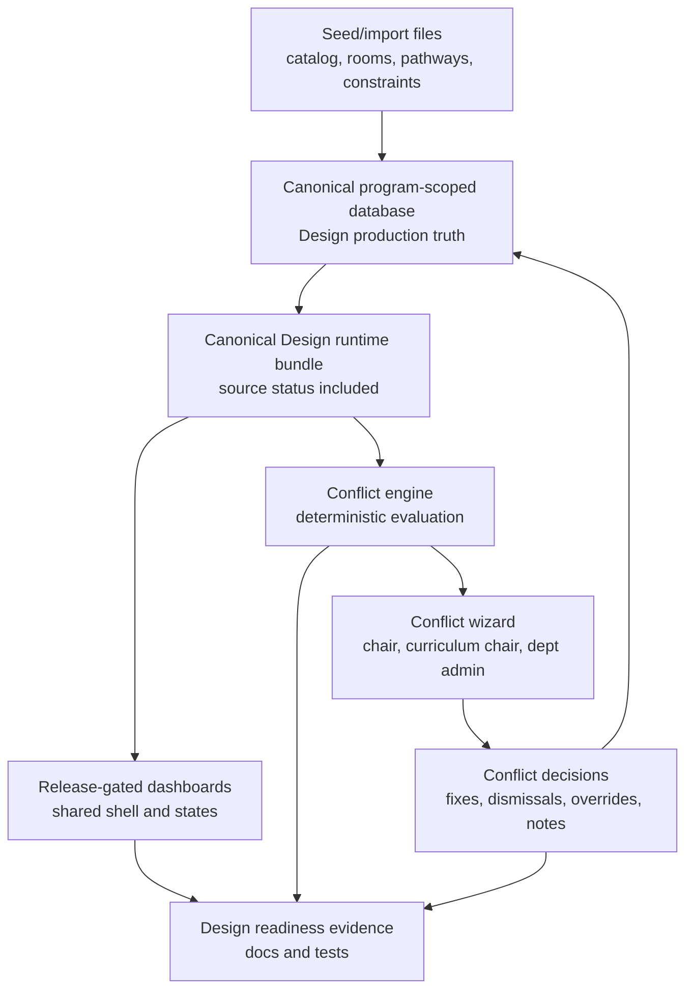
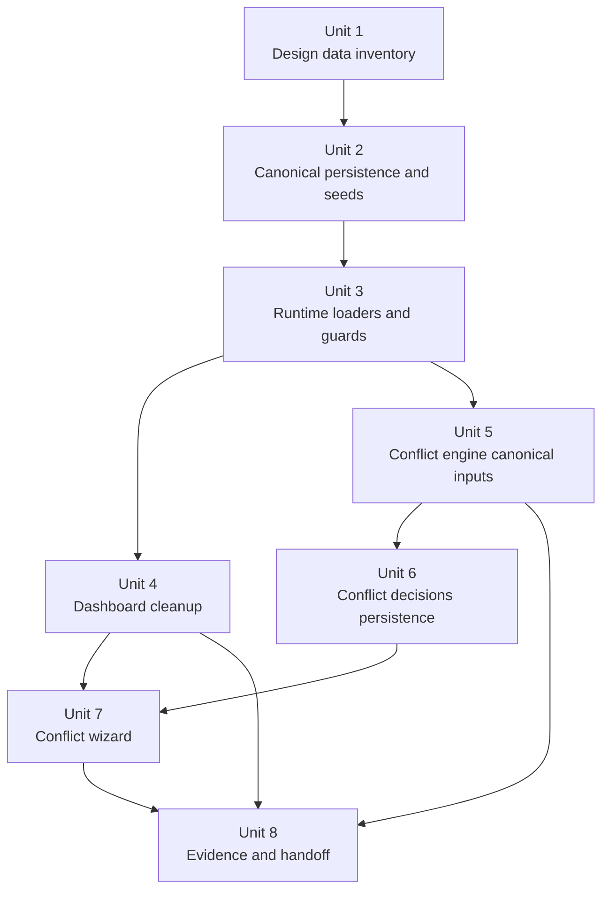

# refactor: Design data truth, dashboard cleanup, and conflict workflow readiness

## Overview

This plan resets the next execution target around the original core product: the Design program scheduler. The previous production-readiness work found the right foundation, but the next work should not be Engineering rollout. The priority is to prove that every user-visible Design scheduling datum has a canonical persisted source, use that source across the dashboards, make the conflict engine correct and explainable, and then give chairs, curriculum chairs, and department admins a guided conflict-resolution workflow.

Short answer to the current state question: no, "everything is in the database" is not fully fixed yet. The save path and some canonical Design program configuration work are in place or in progress, and the `codex/production-readiness-audit` branch added important baseline work. The audit still classifies release-gated surfaces as `unknown-or-mixed` because local JSON, localStorage, embedded Design defaults, and fallback data still shape production-visible behavior.

**Target branch assumption:** implementation should start from `codex/production-readiness-audit` or first carry its readiness docs, canonical dashboard data work, course catalog sync work, and related tests into the active work branch. If execution starts directly from `develop`, Unit 1 must include that carry-forward before modifying the audit files listed below.

## Problem Frame

Program Command was built first for the EWU Design scheduler. The product now has a hybrid runtime: database-backed schedules and program configuration exist alongside local course catalogs, local room and rule files, local workload state, static profile defaults, and dashboard-specific transforms. That makes the conflict engine and dashboards hard to trust because two pages can look at different "truths" for courses, rooms, faculty workload, pathways, constraints, or enrollment demand.

The path forward is to narrow the release gate to Design first. Once Design's canonical data and conflict workflow are trustworthy, dashboard cleanup becomes meaningful and later multi-department work has a solid foundation instead of inheriting ambiguity.

## Current State

| Area | State | Planning implication |
| --- | --- | --- |
| Core saved schedule path | Partly canonical | Keep the year-scoped Supabase save and reload contract as the backbone. |
| Design program config | Partly seeded on the readiness branch | Promote this into the canonical runtime path before relying on it everywhere. |
| Course catalog | Improved on `codex/production-readiness-audit`, but still local-file-derived | Treat local catalog files as seed/import inputs, not runtime production truth. |
| Rooms, faculty, constraints, pathways, release time | DB tables exist for many areas, but runtime still mixes DB and fallback paths | Inventory every datum and close gaps before dashboard polish. |
| Dashboards | Some canonical dashboard work exists on the readiness branch | Clean up after source status is reliable, not before. |
| Conflict engine | Well-tested in slices, but still carries embedded Design assumptions | Move real conflict inputs to canonical Design data and persist decisions. |
| Conflict UX | Not yet a chair/admin wizard | Add a guided workflow once engine outputs and decision state are stable. |

## Dependencies / Prerequisites

- The useful readiness artifacts on `codex/production-readiness-audit` must be present in the implementation branch before Units 1-4 can be completed cleanly.
- Supabase Design program seed/config work must be available before the runtime bundle can be treated as canonical.
- Existing conflict engine characterization tests should be passing before Unit 5 changes hardcoded Design assumptions.
- A tester-facing `TRAVIS.md` note should remain in place throughout execution so the active branch, known blockers, and test focus stay obvious.

## Requirements Trace

- R1. Make the Design program the primary release-gated target before Engineering or other departments.
- R2. Inventory every Design scheduling data class and classify each as canonical DB-backed, draft-only local state, seed/import source, or blocking mixed source.
- R3. Move runtime production truth for Design into program-scoped persisted data, or explicitly exclude a datum from production behavior.
- R4. Preserve local JSON and localStorage only for seed/import, demo/dev fallback, or draft recovery. They must not masquerade as production truth.
- R5. Normalize dashboards after data truth so each dashboard reads from the same canonical runtime bundle and source-status model.
- R6. Make the conflict engine evaluate canonical Design inputs, including schedules, courses, rooms, faculty, constraints, pathways, prerequisites, workload/release time, and enrollment demand where available.
- R7. Make conflict outputs deterministic, explainable, severity-ranked, and actionable for chairs, curriculum chairs, and department admins.
- R8. Persist user decisions around conflict review, including accepted fixes, dismissed items, overrides, notes, and audit metadata.
- R9. Design a conflict engine wizard that guides users from issue review to recommended fixes to saved decisions.
- R10. Update readiness docs and tests so "Design data truth plus conflict workflow" is the next verifiable gate.

## Scope Boundaries

- Do not start Engineering rollout in this plan. Engineering is deferred until Design data truth and conflict workflow evidence pass.
- Do not treat dashboard cleanup as a standalone visual refresh. It follows canonical data convergence.
- Do not remove local draft recovery behavior that protects unsaved user work. Reclassify it and label it clearly.
- Do not mutate production Supabase data without reviewed migrations, seed scripts, and rollback or re-run guidance.
- Do not build AI optimization or automatic schedule generation as the core deliverable. Deterministic conflict correctness comes first.
- Do not require every legacy page to become release-gated if it is not part of the Design scheduling workflow. Non-gated pages should be labeled or excluded explicitly.

### Deferred to Separate Tasks

- Engineering department onboarding: separate follow-on after the Design gate passes.
- Full multi-department shell/platform rollout: separate follow-on after the canonical runtime contract is proven by Design.
- Broad brand or marketing redesign: outside this readiness pass.

## Context & Research

### Relevant Code and Patterns

- `js/db-service.js` already centralizes Supabase reads and writes, but still falls back to `data/course-catalog.json`, `workload-data.json`, `data/room-constraints.json`, and `data/scheduling-rules.json` when Supabase is not configured.
- `scripts/supabase-schema.sql`, `scripts/supabase-program-id-migration-t02.sql`, `scripts/supabase-current-program-helper-t04.sql`, `scripts/supabase-save-attribution-a06.sql`, and `scripts/supabase-schedule-sync-rpc.sql` provide the existing persistence and program-scoping foundation.
- `scripts/supabase-program-config-seed-t07.sql`, `docs/supabase-program-config-seed-t07.md`, `js/profile-loader.js`, and `js/program-shell.js` are the current path toward canonical Design program config.
- `scripts/sync-course-catalog.cjs` on `codex/production-readiness-audit` shows the newer course-catalog drift correction path. It should become an import/seed path, not a runtime truth source.
- `js/canonical-dashboard-data.js`, `tests/canonical-dashboard-data.test.js`, and the dashboard runtime tests on `codex/production-readiness-audit` are the strongest prior art for converging dashboards on one data bundle.
- `pages/schedule-builder.js`, `pages/constraints-dashboard.js`, `pages/recommendations-dashboard.js`, `pages/course-optimizer-dashboard.js`, `pages/workload-dashboard.js`, and `pages/release-time-dashboard.js` are the main Design workflow surfaces to normalize.
- `js/conflict-engine.js` has a mature plugin/scoring/test shape, but still includes embedded pathway pairings, fallback taxonomy, and assumptions that need canonical program data.
- `tests/conflict-engine.plugins.test.js`, `tests/conflict-engine.severity-taxonomy.test.js`, `tests/conflict-engine.pathway-aware-scoring.test.js`, `tests/conflict-engine.room-fit-recommendations.test.js`, `tests/conflict-engine.ay-setup.test.js`, and `tests/conflict-engine.regression-scenarios.test.js` provide the conflict characterization suite to extend.
- `docs/audits/data-truth-audit.md`, `docs/audits/production-source-of-truth-policy.md`, `docs/audits/dashboard-shell-baseline.md`, `docs/audits/production-readiness-program.md`, and `docs/audits/multi-department-release-gate.md` on `codex/production-readiness-audit` are the prior readiness baseline.

### Institutional Learnings

- No `docs/solutions/` library is present in this checkout. This plan relies on the readiness audit branch, current contract docs, and the existing test suite as the institutional memory.

### External References

- None. The repo already contains the relevant architecture, audit, data, and dashboard patterns needed for this plan.

## Key Technical Decisions

- Design is the release-gated program for this pass: the implementation should prove the product works for Design before generalizing it.
- Canonical data means program-scoped persisted data that can reload consistently from Supabase or a clearly named persisted store. Local files can seed or import, but should not be the production runtime source.
- Data truth precedes dashboard cleanup: dashboards should converge on canonical inputs before their shells and visual states are normalized.
- The conflict engine should consume the same canonical Design runtime bundle as dashboards, not a separate hardcoded model.
- Conflict decisions are product data: accepted resolutions, dismissals, overrides, and notes should be persisted with user and timestamp attribution.
- The conflict wizard should be a dedicated workflow with entry points from schedule builder and dashboards. Role-specific controls should adjust permissions and framing, not create separate conflict truths.
- The readiness branch should be treated as prior work to carry forward, not as a finished fix.

## Open Questions

### Resolved During Planning

- Has the database truth problem already been fixed? No. It is partly addressed on the readiness branch, but several release-gated Design surfaces remain `unknown-or-mixed`.
- Should Engineering rollout continue now? No. It is explicitly deferred until Design data truth, dashboards, and conflict workflow are trustworthy.
- Should the conflict wizard be embedded only in the schedule builder? No. It should be a dedicated page/workflow with schedule-builder entry points, because chairs and department admins need a review and decision experience beyond slot editing.
- Should localStorage be removed everywhere? No. It remains acceptable for draft recovery and UI state when labeled and separated from canonical truth.

### Deferred to Implementation

- Exact database shape for conflict decisions and overrides: decide while writing migrations against the current Supabase schema.
- Exact source for enrollment demand/projections when historical data is incomplete: inventory first, then either persist the data or mark the capability as unavailable.
- Exact role mapping for chair, curriculum chair, and department admin: use existing auth/program-role data where possible, and document any temporary role assumptions.
- Whether any legacy dashboard should be excluded from the Design release gate: decide after the surface inventory is updated.

## High-Level Technical Design

> *This illustrates the intended approach and is directional guidance for review, not implementation specification. The implementing agent should treat it as context, not code to reproduce.*

## Implementation Units

## Phased Delivery

### Phase 1: Prove Design data truth

- Unit 1 inventories every Design datum and carries forward the readiness audit baseline.
- Unit 2 closes persistence gaps so each required datum has a canonical home or explicit exclusion.
- Unit 3 makes runtime loading enforce the source-of-truth decision.

### Phase 2: Make the product surfaces agree

- Unit 4 normalizes dashboards around the canonical runtime bundle.
- Unit 5 makes conflict evaluation consume the same canonical Design inputs.

### Phase 3: Make conflict review durable and usable

- Unit 6 persists decisions and role-aware review history.
- Unit 7 ships the guided wizard for chairs, curriculum chairs, and department admins.

### Phase 4: Package the gate for testing

- Unit 8 updates evidence, handoff docs, and readiness status for tomorrow's Design testing path.

- [ ] **Unit 1: Build the Design data source inventory**

**Goal:** Produce the definitive list of every Design datum that matters to production scheduling, dashboards, and conflict evaluation, with one source classification per datum.

**Requirements:** R1, R2, R4, R10

**Dependencies:** Existing readiness audit artifacts from `codex/production-readiness-audit`.

**Files:**
- Create: `docs/audits/design-data-source-inventory.md`
- Modify: `docs/audits/data-truth-audit.md`
- Modify: `docs/audits/production-source-of-truth-policy.md`
- Modify: `docs/audits/production-surface-inventory.md`
- Modify: `scripts/audit-runtime-dependencies.js`
- Test: `tests/data-truth-audit-doc.test.js`
- Test: `tests/audit-runtime-dependencies.test.js`
- Test: `tests/design-data-source-inventory.test.js`

**Approach:**
- Inventory program config, academic years, courses, rooms, faculty, faculty preferences, scheduled sections, constraints/rules, pathways, prerequisites, release time, AY setup/workload targets, enrollment history, projected enrollment, recommendations inputs, dashboard summaries, and conflict decisions.
- Classify each datum as canonical DB-backed, draft-only local state, seed/import source, dev/demo fallback, or blocking mixed source.
- Update the audit vocabulary so Design readiness can pass independently of broader multi-department readiness.
- Mark every local file use as either seed/import, dev/demo fallback, or blocking runtime fallback.

**Execution note:** Start characterization-first. Capture the actual current state before changing runtime paths.

**Patterns to follow:**
- `docs/audits/data-truth-audit.md`
- `docs/audits/production-source-of-truth-policy.md`
- `scripts/audit-runtime-dependencies.js`

**Test scenarios:**
- Happy path - inventory includes every release-gated Design surface and every required data class listed in this unit.
- Edge case - a datum used only for draft recovery is classified as draft-only local state rather than incorrectly marked as a production blocker.
- Error path - a page that still fetches a local JSON file for production-visible behavior is reported as blocking mixed source.
- Integration - audit docs and scanner target lists stay aligned so no release-gated Design surface lacks either scan coverage or an explicit manual-evidence note.

**Verification:**
- The inventory makes it clear which data classes are already canonical, which are merely seed/import files, and which block the Design gate.
- The audit no longer answers only "multi-department readiness"; it has a Design-first pass/fail path.

- [ ] **Unit 2: Close canonical persistence gaps for Design data**

**Goal:** Ensure every Design data class needed for scheduling and conflict evaluation has a persisted, program-scoped home or a documented exclusion from runtime production truth.

**Requirements:** R2, R3, R4, R6, R10

**Dependencies:** Unit 1.

**Files:**
- Modify: `scripts/supabase-schema.sql`
- Modify: `scripts/supabase-program-id-migration-t02.sql`
- Modify: `scripts/supabase-program-config-seed-t07.sql`
- Modify: `scripts/supabase-save-attribution-a06.sql`
- Modify: `scripts/seed-constraints.sql`
- Modify: `scripts/sync-course-catalog.cjs`
- Create: `scripts/supabase-design-data-readiness.sql`
- Create: `docs/design-canonical-data-contract.md`
- Test: `tests/supabase-program-config-seed-t07.test.js`
- Test: `tests/course-catalog.sync.test.js`
- Test: `tests/supabase-design-data-contract.test.js`

**Approach:**
- Treat `data/course-catalog.json`, `data/room-constraints.json`, `data/scheduling-rules.json`, `data/pathways.json`, `data/prerequisite-graph.json`, and `data/release-time-adjustments.json` as import/seed inputs.
- Add or extend persistence for any Design data class that currently exists only in local files or embedded runtime defaults.
- Keep existing tables where they fit: `courses`, `rooms`, `faculty`, `faculty_preferences`, `scheduled_courses`, `scheduling_constraints`, `release_time`, `pathways`, and `pathway_courses`.
- Add only the missing persistence surface needed for conflict decisions, demand/projection source status, or data-readiness evidence.
- Ensure program scoping and write attribution apply consistently to any new or extended table.

**Patterns to follow:**
- `scripts/supabase-program-id-migration-t02.sql`
- `scripts/supabase-save-attribution-a06.sql`
- `scripts/supabase-schedule-sync-rpc.sql`
- `scripts/sync-course-catalog.cjs`

**Test scenarios:**
- Happy path - Design course catalog seed/import data maps to persisted course records without dropping prerequisites, credit ranges, modality, offered quarters, or workload multipliers.
- Happy path - Design room, constraint, pathway, and release-time data has a canonical persisted destination or an explicit documented exclusion.
- Edge case - variable-credit courses and applied-learning courses keep their special workload semantics after import.
- Edge case - missing optional demand/projection inputs do not create fake data; they produce unavailable/source-status metadata.
- Error path - a migration or seed that would create unscoped Design records is rejected by tests.
- Integration - write-attribution and program-scoping tests cover new or extended persistence paths.

**Verification:**
- The canonical data contract names the database home for each required Design datum.
- Import/seed scripts can be re-run without creating duplicate Design data.
- No release-gated Design datum depends only on a local runtime file without being explicitly excluded.

- [ ] **Unit 3: Centralize canonical Design runtime loading and source guards**

**Goal:** Make release-gated runtime modules load one canonical Design data bundle, with visible source-status metadata when a datum is canonical, draft-only, unavailable, or fallback.

**Requirements:** R3, R4, R5, R6, R10

**Dependencies:** Unit 2.

**Files:**
- Modify: `js/db-service.js`
- Modify: `js/supabase-config.js`
- Modify: `js/profile-loader.js`
- Modify: `js/schedule-manager.js`
- Modify: `js/demand-predictor.js`
- Modify: `js/schedule-analyzer.js`
- Modify: `js/schedule-generator.js`
- Modify: `js/canonical-dashboard-data.js`
- Test: `tests/db-service.source-status.test.js`
- Test: `tests/db-service.department-scoping.test.js`
- Test: `tests/schedule-builder.database-baseline.test.js`
- Test: `tests/schedule-modules.direct-data.test.js`
- Test: `tests/canonical-dashboard-data.test.js`
- Test: `tests/supabase-config.runtime-context.test.js`

**Approach:**
- Build or extend a canonical runtime bundle that resolves Design program identity, active academic year, courses, rooms, faculty, scheduled sections, constraints, pathways, release time, workload targets, and available demand/projection inputs.
- Make source status part of the returned data so UI surfaces can disclose when a capability is unavailable instead of quietly falling back.
- Remove direct production reads from local JSON in release-gated modules. Any remaining local reads should be isolated behind dev/demo or import paths.
- Keep local draft state in schedule editing flows, but ensure reloadable production views come from persisted state.

**Execution note:** Add characterization coverage around existing fallback behavior before tightening guards.

**Patterns to follow:**
- `js/db-service.js`
- `js/canonical-dashboard-data.js`
- `tests/db-service.source-status.test.js`
- `tests/schedule-builder.runtime-source-banner.test.js`

**Test scenarios:**
- Happy path - with Supabase configured and Design data present, the runtime bundle reports canonical sources and returns consistent courses, sections, rooms, faculty, constraints, and pathways.
- Happy path - schedule reload uses persisted scheduled sections instead of stale local draft state.
- Edge case - missing optional projected enrollment returns unavailable metadata while dashboards and conflict engine remain stable.
- Edge case - unsaved schedule draft recovery remains local but is clearly marked draft-only.
- Error path - database read failure does not silently substitute production-visible local JSON data.
- Integration - schedule builder, dashboards, and conflict engine receive compatible runtime data shapes from the same loading path.

**Verification:**
- Release-gated runtime modules no longer perform direct production fallback reads from local JSON.
- Source-status metadata can explain every missing or fallback datum.

- [ ] **Unit 4: Clean up Design dashboards around the canonical runtime bundle**

**Goal:** Normalize the release-gated dashboards so they share navigation, source status, empty states, summary behavior, and canonical data transforms.

**Requirements:** R5, R10

**Dependencies:** Unit 3.

**Files:**
- Modify: `js/components/app-header.js`
- Modify: `css/program-command-dashboard-theme.css`
- Modify: `css/schedule-builder.css`
- Modify: `css/constraints-dashboard.css`
- Modify: `pages/schedule-builder.html`
- Modify: `pages/schedule-builder.js`
- Modify: `pages/constraints-dashboard.html`
- Modify: `pages/constraints-dashboard.js`
- Modify: `pages/recommendations-dashboard.html`
- Modify: `pages/recommendations-dashboard.js`
- Modify: `pages/course-optimizer-dashboard.html`
- Modify: `pages/course-optimizer-dashboard.js`
- Modify: `pages/workload-dashboard.html`
- Modify: `pages/workload-dashboard.js`
- Modify: `pages/release-time-dashboard.html`
- Modify: `pages/release-time-dashboard.js`
- Test: `tests/constraints-dashboard.canonical-data.test.js`
- Test: `tests/recommendations-dashboard.runtime.test.js`
- Test: `tests/course-optimizer-dashboard.runtime.test.js`
- Test: `tests/schedule-builder.runtime-source-banner.test.js`
- Test: `tests/product-consistency-audit-doc.test.js`

**Approach:**
- Use the dashboard shell baseline from `docs/audits/dashboard-shell-baseline.md` as the normalization target.
- Keep dashboards dense and operational. The job is not a landing page; users need to scan status, compare issues, and act quickly.
- Add consistent source-status and empty-state presentation so users can tell the difference between "no issue", "no data", and "data unavailable".
- Remove duplicated dashboard-specific transforms where `js/canonical-dashboard-data.js` can supply the shared calculation.
- Preserve existing keyboard, save, and edit flows in schedule builder while adding clearer entry points into conflict review.

**Patterns to follow:**
- `docs/audits/dashboard-shell-baseline.md`
- `css/program-command-dashboard-theme.css`
- `js/components/app-header.js`
- `js/canonical-dashboard-data.js`

**Test scenarios:**
- Happy path - each release-gated dashboard renders canonical Design data and shows the same active program/year context.
- Happy path - recommendations and optimizer dashboards agree on scheduled sections, projected enrollment, and faculty workload totals.
- Edge case - dashboards with no canonical data show a useful empty state instead of stale local fallback values.
- Edge case - source-status banners fit in compact dashboard layouts without overlapping controls.
- Error path - source load failure is visible and does not render misleading recommendations.
- Integration - shared header navigation and conflict-wizard entry points are consistent across schedule builder and dashboard pages.

**Verification:**
- Dashboards look and behave like one product surface while preserving their specific workflows.
- Dashboard tests prove canonical runtime data is the source for release-gated summaries and recommendations.

- [ ] **Unit 5: Make the conflict engine run on canonical Design inputs**

**Goal:** Replace hardcoded and mixed-source conflict assumptions with canonical Design schedule, pathway, room, faculty, workload, and enrollment inputs.

**Requirements:** R6, R7, R10

**Dependencies:** Unit 3.

**Files:**
- Modify: `js/conflict-engine.js`
- Modify: `js/constraints-engine.js`
- Modify: `js/schedule-data-utils.js`
- Modify: `js/schedule-evaluator.js`
- Modify: `js/canonical-dashboard-data.js`
- Create: `docs/conflict-engine-design-contract.md`
- Test: `tests/conflict-engine.plugins.test.js`
- Test: `tests/conflict-engine.severity-taxonomy.test.js`
- Test: `tests/conflict-engine.pathway-aware-scoring.test.js`
- Test: `tests/conflict-engine.room-fit-recommendations.test.js`
- Test: `tests/conflict-engine.ay-setup.test.js`
- Test: `tests/conflict-engine.regression-scenarios.test.js`
- Test: `tests/conflict-engine.design-canonical-inputs.test.js`

**Approach:**
- Define the canonical conflict input contract: schedule rows, normalized course metadata, room fit rules, faculty assignments, faculty preferences, constraints, pathways/prerequisites, release-time/workload targets, and demand/projection availability.
- Move embedded Design pathway pairings and room assumptions behind canonical data resolution. Keep fallback constants only for tests or dev/demo mode with explicit source status.
- Keep the existing plugin model and severity taxonomy, but make each issue explain which canonical data produced it.
- Make output stable enough for a wizard: issue id, issue type, severity/tier, affected courses, affected users or groups where known, cause, suggested actions, source status, and blocks-save flag.
- Treat missing canonical inputs as explainable "cannot evaluate" warnings where appropriate rather than producing false conflicts.

**Execution note:** Extend the existing conflict characterization suite before removing hardcoded assumptions.

**Patterns to follow:**
- `js/conflict-engine.js`
- `tests/conflict-engine.scoring-v2.test.js`
- `tests/conflict-engine.constraint-aliases.test.js`
- `tests/conflict-engine.slot-resolutions.test.js`

**Test scenarios:**
- Happy path - two graduation-critical pathway courses scheduled in the same slot produce a high-severity explainable conflict from persisted pathway data.
- Happy path - faculty and room double-booking conflicts use canonical faculty and room ids when available, while still displaying readable names.
- Happy path - AY setup alignment uses canonical workload and release-time targets instead of local workload assumptions.
- Edge case - missing projected enrollment prevents enrollment-demand scoring but does not suppress unrelated conflicts.
- Edge case - cross-listed, variable-credit, online, or roomless sections normalize consistently before evaluation.
- Error path - missing canonical pathway data produces a source-status warning rather than falling back to embedded pairings.
- Integration - conflict summaries match dashboard counts and schedule-builder blocks-save behavior.

**Verification:**
- Conflict engine tests prove canonical inputs drive the main Design conflict categories.
- The engine can explain why each issue exists and what source data was used.

- [ ] **Unit 6: Persist conflict decisions, overrides, and review history**

**Goal:** Treat conflict review as durable product data so chairs and admins can save decisions, revisit rationale, and distinguish unresolved conflicts from accepted risk.

**Requirements:** R8, R9, R10

**Dependencies:** Unit 5.

**Files:**
- Modify: `scripts/supabase-schema.sql`
- Modify: `scripts/supabase-program-id-migration-t02.sql`
- Modify: `scripts/supabase-save-attribution-a06.sql`
- Modify: `scripts/supabase-rls-hardening.sql`
- Modify: `scripts/supabase-rls-auth-user-scope.sql`
- Modify: `js/db-service.js`
- Modify: `js/supabase-config.js`
- Create: `docs/conflict-decision-contract.md`
- Test: `tests/conflict-decision-contract.test.js`
- Test: `tests/db-service.conflict-decisions.test.js`
- Test: `tests/supabase-program-rls-t03.test.js`

**Approach:**
- Add a persisted decision model for conflict review outcomes: accepted resolution, dismissed issue, accepted risk/override, note/comment, assignee or reviewer where available, program id, academic year, issue fingerprint, and attribution.
- Use stable issue fingerprints so decisions can survive page reloads and minor display changes, while still invalidating when the underlying schedule issue changes materially.
- Keep role handling simple and explicit: chairs and curriculum chairs can review/accept curriculum-impacting decisions; department admins can manage administrative notes and operational resolution state; final enforcement should follow existing auth/program role capabilities.
- Ensure decisions can be read back into schedule builder, dashboards, and the wizard.

**Patterns to follow:**
- `scripts/supabase-current-program-helper-t04.sql`
- `scripts/supabase-save-attribution-a06.sql`
- `docs/scheduler-save-contract.md`
- `docs/supabase-rls-write-policy-matrix.md`

**Test scenarios:**
- Happy path - saving an accepted resolution persists program id, academic year, issue fingerprint, decision type, note, updated user, and timestamp.
- Happy path - dismissed conflicts are hidden from active review but remain visible in history.
- Edge case - when a schedule change alters an issue fingerprint, the old decision is retained as history and the new issue appears unresolved.
- Edge case - duplicate save of the same decision updates the existing record instead of creating noisy duplicates.
- Error path - unauthenticated or wrong-program writes are rejected by RLS tests.
- Integration - conflict engine output can be joined with saved decisions to produce active, resolved, and accepted-risk buckets.

**Verification:**
- Conflict decisions are reloadable and scoped to the active Design program and academic year.
- Role and RLS tests protect decision writes from cross-program leakage.

- [ ] **Unit 7: Build the conflict engine wizard for chairs and admins**

**Goal:** Provide a guided conflict review workflow that lets chairs, curriculum chairs, and department admins understand conflicts, preview fixes, and save decisions without editing raw data blindly.

**Requirements:** R7, R8, R9, R10

**Dependencies:** Unit 4, Unit 5, Unit 6.

**Files:**
- Create: `pages/conflict-wizard.html`
- Create: `pages/conflict-wizard.js`
- Modify: `pages/schedule-builder.html`
- Modify: `pages/schedule-builder.js`
- Modify: `pages/constraints-dashboard.html`
- Modify: `pages/constraints-dashboard.js`
- Modify: `css/program-command-dashboard-theme.css`
- Modify: `js/components/app-header.js`
- Test: `tests/conflict-wizard.flow.test.js`
- Test: `tests/conflict-wizard.decisions.test.js`
- Test: `tests/schedule-builder.conflict-wizard-entry.test.js`

**Approach:**
- Build a dedicated wizard page with entry points from schedule builder and relevant dashboards.
- Organize the flow around operational decisions: review issue board, filter by severity/type/role, inspect cause and affected courses, preview suggested fixes, save decision, and return to schedule context.
- Use role-aware copy and controls without fragmenting the data model. Chairs focus on final schedule risk and resource tradeoffs; curriculum chairs focus on pathway/graduation impact; department admins focus on operational completeness, rooms, staffing, and documentation.
- Show source-status warnings inside the wizard when an issue cannot be fully evaluated because canonical inputs are missing.
- Allow "what changed if I accept this fix?" preview without committing schedule changes until the user confirms.

**Patterns to follow:**
- `pages/schedule-builder.js`
- `pages/constraints-dashboard.js`
- `css/program-command-dashboard-theme.css`
- `js/components/app-header.js`

**Test scenarios:**
- Happy path - a chair opens the wizard from schedule builder, reviews a hard-block conflict, previews a recommended slot move, and saves an accepted resolution.
- Happy path - a curriculum chair filters to pathway/graduation conflicts and sees affected course pairs and explanation details.
- Happy path - a department admin records an operational note on a room or staffing conflict and sees it persist after reload.
- Edge case - no conflicts produces a complete empty state with source-status detail, not a blank page.
- Edge case - unresolved missing-data warnings are visible and cannot be mistaken for a clean schedule.
- Error path - failed decision save leaves the wizard state intact and shows a recoverable error.
- Integration - accepted, dismissed, and active conflicts are reflected consistently in the wizard, schedule builder, and dashboard summaries.

**Verification:**
- The wizard can support the three target user roles without requiring users to inspect raw conflict JSON or source files.
- Browser verification confirms the wizard layout is usable at desktop and narrow widths with no overlapping controls.

- [ ] **Unit 8: Close the Design readiness gate and update handoff docs**

**Goal:** Turn the implementation into evidence that the Design core workflow is ready for user testing, with clear remaining blockers before any other department work resumes.

**Requirements:** R1, R2, R5, R6, R7, R8, R9, R10

**Dependencies:** Units 1-7.

**Files:**
- Modify: `docs/audits/data-truth-audit.md`
- Modify: `docs/audits/multi-department-release-gate.md`
- Modify: `docs/audits/production-readiness-program.md`
- Modify: `docs/audits/dashboard-shell-baseline.md`
- Modify: `docs/design-canonical-data-contract.md`
- Modify: `docs/conflict-engine-design-contract.md`
- Modify: `docs/conflict-decision-contract.md`
- Modify: `TRAVIS.md`
- Test: `tests/production-readiness-program-doc.test.js`
- Test: `tests/multi-department-release-gate-doc.test.js`
- Test: `tests/product-consistency-audit-doc.test.js`
- Test: `tests/data-truth-audit-doc.test.js`

**Approach:**
- Update the gate from broad "multi-department readiness" to a two-step posture: Design core gate first, then multi-department gate.
- Record exactly which Design data classes are canonical and which capabilities remain intentionally unavailable or excluded.
- Document the dashboard and conflict wizard evidence a tester should use tomorrow.
- Keep `TRAVIS.md` as the top-level human handoff: what was fixed, what remains, what branch to test, and what not to start yet.

**Patterns to follow:**
- `TRAVIS.md`
- `docs/audits/production-readiness-program.md`
- `docs/audits/multi-department-release-gate.md`

**Test scenarios:**
- Happy path - readiness docs state the Design gate status, evidence, and remaining blockers in one vocabulary.
- Edge case - any intentionally excluded legacy surface is named with a reason and is not silently counted as passed.
- Error path - doc tests fail if required gate evidence sections are removed.
- Integration - handoff docs align with the implementation state and do not imply Engineering rollout is ready.

**Verification:**
- A tester can open the handoff and know exactly what to test in the Design workflow.
- The docs answer whether the product is ready for Engineering: not until the Design gate evidence passes and remaining multi-department blockers are explicitly cleared.

## System-Wide Impact

- **Interaction graph:** Supabase program identity feeds runtime loaders, which feed schedule builder, dashboards, conflict engine, and wizard decisions. Any mismatch in active program/year can corrupt multiple surfaces.
- **Error propagation:** Data-load failures should surface as source-status messages and unavailable capabilities, not silent local fallback.
- **State lifecycle risks:** Draft schedule edits, persisted schedules, conflict decisions, and accepted-risk overrides have different lifetimes. The implementation must not merge draft and canonical state accidentally.
- **API surface parity:** Schedule builder, dashboards, and wizard should all use the same conflict output and decision state. A conflict dismissed in one surface should not reappear as active in another.
- **Integration coverage:** Unit tests alone are not enough. Cross-layer tests should prove canonical data loads into dashboards, conflict evaluation, persisted decisions, and reload behavior.
- **Unchanged invariants:** Existing year-scoped schedule save/reload behavior remains the backbone. This plan extends the data and conflict model around it rather than replacing it.

## Success Metrics

- Every release-gated Design data class has a source classification and no production-required datum remains `unknown-or-mixed`.
- Schedule builder and dashboards agree on active program, academic year, scheduled sections, courses, rooms, faculty, and source status.
- Conflict engine results are deterministic for the canonical Design dataset and explain their source data.
- Conflict decisions persist, reload, and remain scoped to Design program plus academic year.
- The conflict wizard supports chair, curriculum chair, and department admin review without exposing raw data internals.
- Handoff docs clearly state Design readiness status and keep Engineering rollout deferred until the proper gate passes.

## Risks & Dependencies

| Risk | Mitigation |
| --- | --- |
| Data migration becomes larger than expected | Inventory first, reuse existing tables where possible, and add only missing persistence surfaces needed for Design gate evidence. |
| Local fallback removal breaks demo/dev workflows | Preserve fallback behind explicit dev/demo mode and source-status labels instead of deleting all local paths blindly. |
| Conflict engine behavior changes while tests still assume embedded Design constants | Extend characterization tests before moving constants behind canonical persisted data. |
| Wizard UX becomes too broad | Limit the first wizard to review, explain, preview, decide, and persist. Defer advanced auto-optimization. |
| Role permissions are not fully modeled yet | Start with existing auth/program role primitives and document any temporary assumptions in the decision contract. |
| Dashboard cleanup hides data gaps behind nicer UI | Require source-status and empty-state tests before treating dashboard cleanup as complete. |

## Documentation / Operational Notes

- `TRAVIS.md` should remain the top-level operator note while this work is active.
- The implementation should start from or carry forward the useful artifacts on `codex/production-readiness-audit` before adding new work.
- Any Supabase migration or seed should include re-run behavior and a short operator note so a tester can refresh Design data without hand-editing tables.
- Browser verification should include schedule builder, constraints dashboard, recommendations/optimizer dashboards, and the new conflict wizard.
- The final handoff should say plainly whether Design is ready for testing and whether Engineering remains blocked.

## Sources & References

- Origin document: `docs/brainstorms/2026-04-16-production-readiness-multi-department-program-requirements.md`
- Prior plan: `docs/plans/2026-04-16-001-refactor-production-readiness-gate-plan.md`
- Prior audit: `docs/audits/data-truth-audit.md`
- Prior audit: `docs/audits/production-source-of-truth-policy.md`
- Prior audit: `docs/audits/dashboard-shell-baseline.md`
- Prior audit: `docs/audits/production-readiness-program.md`
- Runtime service: `js/db-service.js`
- Conflict engine: `js/conflict-engine.js`
- Schedule builder: `pages/schedule-builder.js`
- Canonical dashboard data: `js/canonical-dashboard-data.js`
- Design seed/config work: `scripts/supabase-program-config-seed-t07.sql`
- Course catalog sync prior art: `scripts/sync-course-catalog.cjs`
- Existing conflict tests: `tests/conflict-engine.plugins.test.js`, `tests/conflict-engine.severity-taxonomy.test.js`, `tests/conflict-engine.pathway-aware-scoring.test.js`, `tests/conflict-engine.regression-scenarios.test.js`
