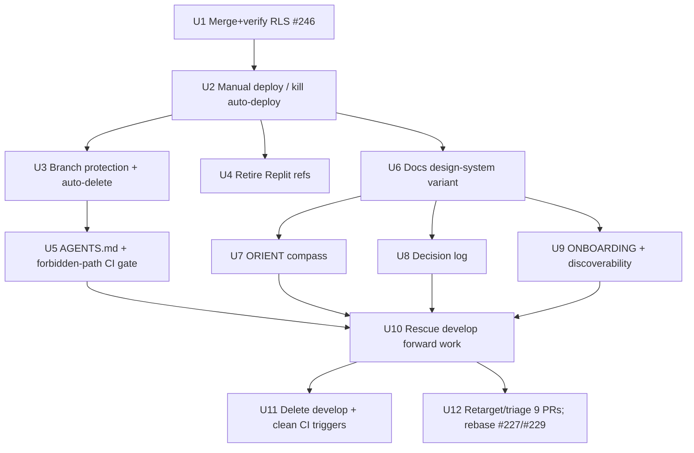

# refactor: Forward Operating Model — Trunk-Based Delivery + Reorientation Layer

## Overview

Move `program-command` from a drifted gitflow model to **trunk-based single-`main`**, relocate production-data safety to the **deploy/RLS boundary** (where it actually lives), and build an **HTML reorientation layer** so an intermittent solo maintainer working alongside autonomous agents can return cold and stay safe. Sequenced so the live data risk is defused first, before any larger change.

## Problem Frame

A solo, intermittently-available maintainer supervises autonomous agents that generate branches/PRs continuously. Gitflow caused `develop` to drift ~2 months from `main`; PRs rotted; the maintainer can't tell solved from stale. The assumed safety of a separate `develop` branch is false — production data is isolated by the environment/deploy boundary (two Supabase projects + host routing + read-only public surface), and because the prod Supabase **anon key is public by design**, **RLS (#246) is the only real data-safety control**. Today `main` auto-deploys to production on every push with soft RLS — a live risk independent of any branching decision. (See origin: `docs/brainstorms/2026-05-15-forward-operating-model-requirements.md`.)

## Requirements Trace

- R1–R4. Trunk-based `main`; rescue `develop`'s forward work; delete `develop`; resolve the 9 open strategic PRs.
- R5–R9. Branch protection (required CI); manual prod deploy only; prod read-only public; RLS #246 first as hard prerequisite; retire dead Replit references.
- R10–R11. Sequence/rebase strategic PRs toward college-command after the rescue lands.
- R12–R15. ORIENT compass + decision log + ONBOARDING, all HTML in a docs variant of the product design system, with freshness + discoverability.
- R16. Short-lived branches; `AGENTS.md` autopilot rules incl. forbidden paths; enforced (not assumed) autopilot deploy barrier.

## Scope Boundaries

- No application product feature changes — operating model, infra, and docs only.
- No separate staging/preview environment — one URL + manual prod button.
- No build tooling — no-build vanilla HTML/JS stays (HTML docs are consistent with this, not a violation).
- No Supabase schema redesign — RLS hardening rides on existing PR #246 as-is.

## Context & Research

### Relevant Code and Patterns

- `.github/workflows/deploy-pages.yml` — currently `on: push: branches: [main]` + `workflow_dispatch`; static rsync deploy. Target of Units 2.
- `.github/workflows/ci.yml` — jobs named `test` and `onboarding`; triggers on PRs to `main`/`develop` and pushes to `develop`. Required-check + trigger-cleanup target (Units 2, 3, 7).
- `js/supabase-config.js` — two Supabase projects (`production` `ohnrhjxc…`, `develop` `cstcwplv…`), host/page-based routing, public anon key committed by design. Read-only reference; **forbidden-path** for agents (Unit 5).
- `pages/public-schedule.*`, `css/public-schedule.css`, `css/design-system.css`, `css/program-command-dashboard-theme.css` — Foundry shell + read-only surface; the design-system pattern the docs variant mirrors (Unit 6).
- `docs/supabase-rls-hardening-migration.md`, `docs/supabase-policy-smoke-check.md`, `docs/public-schedule-release-checklist.md` — existing RLS/verification grounding for Unit 1 (#246).
- `docs/plans/2026-05-12-001-refactor-public-schedule-hardening-plan.md` — adjacent prior plan (public-schedule hardening); related, do not duplicate.
- `AGENTS.md` — single "Autopilot Defaults" block; extended in Unit 5.
- PR #246 `codex/supabase-programs-rls` (→ `main`, mergeable, +125/-10) — Unit 1.

### Institutional Learnings

- `docs/solutions/` is empty — no prior solved-problem records to carry forward.
- `docs/dev-data-freshness.md` exists and is relevant to the deferred dev-Supabase-isolation question.

### External References

- None required. GitHub branch protection / required status checks, `workflow_dispatch` gating, and Supabase RLS are well-established; the repo is **public** (verified) so required checks are available at no cost.

## Key Technical Decisions

- **Phase 0 defuses the live risk before anything structural.** Merging #246 and removing auto-deploy-on-push are hours of work and remove the only acute danger; everything else then proceeds without data-safety time pressure. (Origin: Execution Sequence.)
- **RLS #246 is a hard gate, not a soft "first."** No state may exist where `develop` is deleted / trunk cutover is complete but RLS is not verified in prod.
- **Autopilot barrier is enforced, not documented.** Policy (`AGENTS.md` forbidden paths) plus a mechanical CI check that fails when an agent-authored branch modifies `.github/workflows/**`, `ci.yml`, `js/supabase-config.js`, `.env*`, or Supabase policy SQL.
- **Reorientation docs are HTML in a docs design-system variant** — deliberate standing user requirement; reuse `css/design-system.css` + a new `css/docs.css`, no build step.
- **`develop` deletion is gated on rescue.** R3 cannot execute until R2's forward work is verified on `main` (Phase 2 ordering).
- **Full reorientation layer is built up front (Phase 1), before product unblock (Phase 2)** — user-chosen over "product first."

## Open Questions

### Resolved During Planning

- GitHub plan supports required checks? **Yes** — repo `sicxz/program-command` is public (verified); no fallback needed.
- Where do reorientation docs live? `docs/ORIENT.html`, `docs/decision-log.html`, `docs/ONBOARDING.html`, styled by new `css/docs.css` + existing `css/design-system.css`.
- Which 9 PRs? #203, #204, #216, #219, #225, #227, #229, #235, #246 (#246 lands in Phase 0).
- Should Phase 2 be hard-blocked by Phase 1 docs (Units 7–9)? **Yes — maintainer chose to keep the hard lock (2026-05-15).** Adversarial review flagged the stall risk; the maintainer consciously accepts it to guarantee the reorientation layer exists before product work resumes. No dependency relaxation; no minimum-viable-docs fallback.

### Deferred to Implementation

- **[Affects Unit 4][User decision]** Fate of `api-server.js` / `google-sheets-client.js` / `/api/export-to-sheets` (keep+rehost vs. delete). Unit 4 removes only Replit references; this decision is surfaced during Unit 4, not pre-settled.
- **[Affects Unit 11][Technical]** Exact rescue mechanism for `develop`'s forward commits (cherry-pick vs. rebase vs. squash-merge) and conflict order vs. #227/#229 — depends on real conflict state at execution time.
- **[Affects Unit 5][Technical]** Exact agent-authorship signal for the forbidden-path CI check (commit trailer, author email pattern, or PR label) — determined against real agent commit metadata.
- **[Affects Unit 9][Technical]** Whether ONBOARDING is generated by the `/onboarding` skill or hand-authored, and the precise HTML section structure.
- **[Affects Risks][Needs research]** Defense-in-depth for the `develop` Supabase project itself (bounded by no-schema-redesign).

## High-Level Technical Design

> *This illustrates the intended approach and is directional guidance for review, not implementation specification. The implementing agent should treat it as context, not code to reproduce.*

Target operating model:

```
 agents ─┐
 you ────┴─▶ short-lived branch ─▶ PR ─▶ [CI: test + onboarding REQUIRED] ─▶ main
                                                                              │
                              forbidden-path CI check rejects agent edits to  │
                              .github/workflows, ci.yml, supabase-config.js ──┤
                                                                              ▼
                                              YOU run "Deploy to Production"
                                              (workflow_dispatch, CI-green gate)
                                                                              │
                                                                              ▼
                                              GitHub Pages (only deploy) ─▶ PROD Supabase
                                                                              ▲
                                              RLS (#246) hardened FIRST ──────┘ (sole data lock)
```

Unit dependency / phase gating:



## Implementation Units

### Phase 0 — Stop the bleeding (do immediately)

- [ ] **Unit 1: Merge and verify RLS #246 in production**

**Goal:** Make the only real data-safety control live before any structural change.

**Requirements:** R8

**Dependencies:** None (highest priority).

**Files:**
- Modify (via PR #246 merge): Supabase RLS policy SQL referenced by `codex/supabase-programs-rls`
- Reference: `docs/supabase-rls-hardening-migration.md`, `docs/supabase-policy-smoke-check.md`

**Approach:**
- Capture a pre-migration snapshot of the production Supabase RLS policy state (exportable SQL / policy list) as the rollback baseline.
- Review and merge PR #246 (`codex/supabase-programs-rls` → `main`).
- Apply the RLS migration to the production Supabase project.
- Run the existing policy smoke check against production with explicit pass criteria: anon can read exactly what the public surface needs (incl. the specific RPCs `public-schedule.html` calls); anon cannot insert/update/delete; cross-table over-reads denied; `public-schedule.html` renders correctly end-to-end.
- **Rollback:** if any smoke criterion fails post-merge, restore the pre-migration policy snapshot, log the failed attempt in the decision log (Unit 8), and re-approach — do not proceed to Unit 2 until a clean pass with no rollback.

**Execution note:** Characterization-first — record current (pre-#246) anon behavior, then verify the delta after.

**Patterns to follow:** `docs/supabase-policy-smoke-check.md`, `docs/public-schedule-release-checklist.md`.

**Test scenarios:**
- Happy path: anon client reads published schedule via the public RPC → succeeds.
- Error path: anon client attempts insert/update/delete on `scheduled_courses`/faculty tables → denied by RLS.
- Edge case: anon client attempts a broad `select *` on a non-public table → denied.
- Integration: load `public-schedule.html` against production post-migration → renders correctly with no data leakage.

**Verification:** PR #246 merged to `main`; RLS migration confirmed applied in production; smoke check passes on every criterion **and no rollback was needed**. Unit 1 is complete only on a clean pass; a rollback marks it failed (logged) and re-attempted.

- [ ] **Unit 2: Manual "Deploy to Production"; remove auto-deploy-on-push**

**Goal:** Production publishes only by a deliberate human action.

**Requirements:** R6, R7

**Dependencies:** Unit 1 (prod must be RLS-safe before deploy semantics change).

**Files:**
- Modify: `.github/workflows/deploy-pages.yml`

**Approach:**
- Remove the `push: branches: [main]` trigger; `workflow_dispatch` becomes the only path.
- Because `workflow_dispatch` cannot pre-condition on CI, the gate must be a **first step inside the deploy job** that queries the status of the *exact commit being deployed* (the resolved `main` HEAD SHA) for the `test` and `onboarding` checks via the GitHub API, and aborts the job unless both are `success`. Gate on the specific commit SHA, not "most recent CI run," so a later un-CI'd commit on `main` cannot ride a stale green.
- Add a deploy-job step that stamps `docs/ORIENT.html`'s "prod-state-as-of" marker (Unit 7) so ORIENT freshness is mechanical, not a comment-based convention.
- Keep the existing static rsync build/publish steps unchanged.

**Patterns to follow:** existing `deploy-pages.yml` job structure; `ci.yml` job names `test`/`onboarding`.

**Test scenarios:**
- Happy path: maintainer triggers `workflow_dispatch`; deployed `main` SHA has green `test`+`onboarding` → Pages publishes; ORIENT stamp updated.
- Error path: `workflow_dispatch` triggered while the deployed SHA's checks are red/missing → deploy job aborts before publish.
- Edge case: a push to `main` occurs → no deploy is triggered.
- Edge case: green PR merges, then a second un-CI'd commit lands on `main`; dispatch deploying that SHA → aborts (stale-green not honored).

**Verification:** No deploy occurs on push to `main`; a manual dispatch with green CI publishes; a manual dispatch with red CI is blocked.

### Phase 1 — Operating model + reorientation layer (up front)

- [ ] **Unit 3: Branch protection on `main` + merged-branch auto-delete**

**Goal:** Broken code cannot land; branches don't accumulate.

**Requirements:** R1, R5, R16

**Dependencies:** Unit 2.

**Files:**
- Repo settings (GitHub branch protection on `main`) — documented in `docs/ONBOARDING.html` (Unit 9)
- Modify: `.github/workflows/ci.yml` (ensure `test`/`onboarding` run on PRs to `main`)

**Approach:**
- Protect `main`: require `test` + `onboarding` status checks, require PR before merge, no direct pushes.
- The `onboarding` required check must be a **static artifact validation** (the existing `ci.yml` `onboarding` job — verifies the onboarding doc/scaffold exists and is well-formed), **not** a live `/onboarding` skill invocation, so check-passability never depends on external skill availability and cannot lock the maintainer out of merging hotfixes.
- Enable "automatically delete head branches" on merge.
- Confirm `ci.yml` runs the required jobs for PRs targeting `main` (it already triggers on `pull_request` to `main`).

**Test scenarios:**
- Error path: PR with failing `test` → merge blocked by protection.
- Happy path: PR with green `test`+`onboarding` → mergeable; head branch auto-deleted post-merge.
- Edge case: attempted direct push to `main` → rejected.

**Verification:** A red PR cannot merge; a green PR merges and its branch is auto-deleted; direct push to `main` rejected.

- [ ] **Unit 4: Retire dead Replit references**

**Goal:** Documented prod path matches reality (Pages, static).

**Requirements:** R9

**Dependencies:** Unit 2.

**Files:**
- Delete: `.replit`
- Modify: `CLAUDE.md` (remove Replit deploy section; correct prod path to GitHub Pages)
- Surface (do not pre-decide): `api-server.js`, `google-sheets-client.js`, `/api/export-to-sheets` references in `index.html`/`README.md`

**Approach:**
- Remove only Replit-specific references and correct deployment docs.
- Explicitly raise the `api-server.js`/Sheets-export keep-or-cut decision to the maintainer (deferred question) and record the choice in the decision log (Unit 8); do not delete the Node surface under this unit unless the maintainer chooses "cut."

**Execution note:** Pause for the maintainer's keep/cut decision on the Node API surface before touching `api-server.js`.

**Test scenarios:** Test expectation: none — documentation/config removal; correctness is "no stale Replit references remain and no live path was broken."

**Verification:** `.replit` gone; `CLAUDE.md` shows GitHub Pages as prod; api-server decision recorded in the decision log; no working path removed without an explicit decision.

- [ ] **Unit 5: AGENTS.md trunk + forbidden-path rules, enforced by CI**

**Goal:** "Autopilot cannot publish prod / cannot edit safety files" is enforced, not assumed.

**Requirements:** R6, R16

**Dependencies:** Unit 3.

**Files:**
- Modify: `AGENTS.md` (add Trunk & Safety Rules: target `main`, short-lived branches, never deploy prod, forbidden-path set)
- Create: `.github/workflows/guard-forbidden-paths.yml` (or a job in `ci.yml`)

**Approach:**
- Extend `AGENTS.md` with explicit rules and the forbidden-path set: anything under `.github/workflows/**` (**including creation of new files there**, not only modification — closes the "add a new auto-deploy workflow" bypass), `ci.yml`, `js/supabase-config.js`, `.env*`, Supabase policy/SQL files.
- Add a CI check that fails when an agent-authored PR adds or modifies any forbidden path. Design constraints: the check is a **required, non-bypassable status check** (not advisory; maintainers cannot silently merge past it); authorship is evaluated **per-commit**, not by PR author (defeats delegation/impersonation); the only override is a **human-applied label that an agent cannot self-apply**.
- The exact agent-authorship signal (trailer / author-email pattern / label) is deferred-to-implementation, but it must satisfy the per-commit + non-spoofable-by-agent constraints above; if no signal can meet them, fall back to "all PRs touching forbidden paths require human approval" rather than an agent-only rule.

**Execution note:** Test-first — write the failing-PR scenario before the guard logic.

**Patterns to follow:** existing `ci.yml` job/step structure.

**Test scenarios:**
- Happy path: agent-authored PR touching only app code → guard passes.
- Error path: agent-authored PR modifying `.github/workflows/deploy-pages.yml` → guard fails.
- Error path: agent-authored PR modifying `js/supabase-config.js` → guard fails.
- Edge case: human-authored PR (or maintainer override label) modifying a forbidden path → guard passes.

**Verification:** A simulated agent-authored PR touching a forbidden path fails CI; the same change with human override passes.

- [ ] **Unit 6: Docs design-system variant (no build)**

**Goal:** A reusable HTML docs shell matching the product design system.

**Requirements:** R15

**Dependencies:** Unit 2.

**Files:**
- Create: `css/docs.css`
- Create: `docs/_docs-shell.html` (reference template) or documented include pattern
- Reference: `css/design-system.css`, `css/program-command-dashboard-theme.css`, `css/public-schedule.css`

**Approach:**
- Build a lightweight docs layout (header, nav, content) reusing `design-system.css` tokens (EWU brand, Foundry shell); no bundler, plain `<link>` tags.

**Patterns to follow:** `pages/public-schedule.*` + `css/public-schedule.css` Foundry usage.

**Test scenarios:** Test expectation: none — styling/scaffolding; correctness verified visually in Units 7–9.

**Verification:** A sample doc renders with the product look in a browser via `python3 -m http.server` with no build step.

- [ ] **Unit 7: ORIENT compass (HTML)**

**Goal:** Cold reorientation in <5 minutes.

**Requirements:** R12

**Dependencies:** Unit 6.

**Files:**
- Create: `docs/ORIENT.html`

**Approach:**
- One page: what this project is, what's in production, current focus, the explicit next action, where to look. Visible "prod-state-as-of" stamp. The stamp is updated **mechanically by the Unit 2 deploy job** (not by a comment-based convention), so ORIENT can never silently lag prod.

**Test scenarios:** Test expectation: none — content doc; correctness is "a cold reader can state current prod + next action in <5 min."

**Verification:** ORIENT renders in the docs shell; contains a current prod-state stamp and a single explicit next action.

- [ ] **Unit 8: Decision log (HTML), seeded**

**Goal:** The "why" is never reconstructed from memory.

**Requirements:** R13

**Dependencies:** Unit 6.

**Files:**
- Create: `docs/decision-log.html`

**Approach:**
- Reverse-chronological entries (~3 lines: chose / why / rejected). Seed from this effort's Key Decisions and the brainstorm: trunk-over-gitflow, data-safety=RLS not branch, manual deploy, Replit retirement, docs-as-HTML, full-reorientation-up-front. Append at decision time going forward.

**Test scenarios:** Test expectation: none — content doc.

**Verification:** Decision log renders with the seeded entries, newest first.

- [ ] **Unit 9: ONBOARDING (HTML) + discoverability**

**Goal:** Deep onboarding after the compass; reorientation docs are findable.

**Requirements:** R14

**Dependencies:** Unit 6 (and Units 7–8 for cross-links).

**Files:**
- Create: `docs/ONBOARDING.html`
- Modify: `README` and `CLAUDE.md` (add a "Cold start" pointer: ORIENT → decision-log → ONBOARDING)

**Approach:**
- Architecture, data model, two-Supabase routing, deploy flow, branch protection rules, autopilot forbidden paths. Generated via the `/onboarding` skill or hand-authored (deferred); rendered in the docs shell. Link the trio from `README`/`CLAUDE.md` as the cold-start entry point.

**Test scenarios:** Test expectation: none — content/navigation doc.

**Verification:** ONBOARDING renders in the docs shell; `README`/`CLAUDE.md` link the trio; a cold reader can navigate ORIENT → ONBOARDING without searching.

### Phase 2 — Product unblock (college-command)

- [ ] **Unit 10: Rescue `develop`'s forward work onto `main`**

**Goal:** Preserve the ~9 non-merge forward commits (multi-program shell, screenshot/onboarding intake, profile-aware surfaces) on the trunk.

**Requirements:** R2

**Dependencies:** Unit 1 (RLS verified clean in prod — explicit hard gate, not just transitive); Units 5, 7, 8, 9 (trunk discipline + reorientation in place first).

**Files:**
- Reviewed PR(s) into `main`; conflict resolution against `main`'s ~31 forward commits. Exact files determined at execution time.

**Approach:**
- First produce a **forward-work inventory artifact**: the explicit list of `develop`'s non-merge commits (hash, author, one-line purpose) — "non-merge" = commits authored on `develop` that are not themselves merge commits. This artifact is the checkpoint before any conflict resolution and the recovery reference if `develop` is later gone.
- Bring them onto `main` via one or more reviewed PRs. Mechanism (cherry-pick vs. rebase vs. squash) and conflict order are execution-time decisions; record the chosen approach in the decision log.

**Execution note:** Characterization-first means: record `develop`'s behavior on the overlapping hot files (`index.html`, `js/db-service.js`, `pages/schedule-builder.js`, `js/schedule-data-utils.js`), then `main`'s, identify the delta, then resolve — so a conflict resolution cannot silently drop a `develop`-only conditional (e.g., a multi-program-only code path) that the unit test suite does not exercise.

**Test scenarios:**
- Integration: post-rescue, the multi-program/profile-aware surfaces load against the develop Supabase project without regression.
- Happy path: existing `npm test` suite green on `main` after each rescue PR.
- Edge case: each `develop`-only behavior named in the forward-work inventory is explicitly exercised on `main` post-resolution (not relying on `npm test` coverage alone).

**Verification:** Forward work present on `main`; `npm test` green; **every inventory-listed `develop`-only behavior passes an explicit post-resolution check**; approach + a "develop-deletion checkpoint" summary (commits rescued, conflicts resolved, behaviors tested) recorded in the decision log. This summary is the precondition for Unit 11.

- [ ] **Unit 11: Delete `develop`; clean CI/workflow triggers**

**Goal:** Single trunk; no stale integration branch.

**Requirements:** R3

**Dependencies:** Unit 10 (verified, incl. its develop-deletion checkpoint); Unit 1 (RLS verified clean in prod — restated explicitly so an implementer reading this unit alone cannot skip the hard gate).

**Files:**
- Modify: `.github/workflows/ci.yml` (remove `develop` from `pull_request`/`push` triggers)
- Delete branch: `develop` (local + remote)

**Approach:**
- Only after Unit 10's develop-deletion checkpoint exists and Unit 1 is verified: remove `develop` from all workflow triggers, then delete the branch local + remote. Note in the decision log that `develop` is reflog-recoverable for ~90 days as a last resort.

**Test scenarios:**
- Edge case: open a PR after deletion → CI runs against `main` only; no `develop` trigger errors.

**Verification:** `develop` gone (local + remote); no workflow references `develop`; CI green on a `main`-targeted PR.

- [ ] **Unit 12: Retarget, triage, and resolve the 9 strategic PRs**

**Goal:** No rotting PRs; college-command work moves on the trunk.

**Requirements:** R4, R10, R11

**Dependencies:** Unit 10 (rebase #227/#229 only after the rescue baseline lands).

**Files:**
- GitHub PR retargeting/rebasing for #203, #204, #216, #219, #225, #227, #229, #235 (#246 done in Unit 1). No repo files directly; per-PR conflict resolution.

**Approach:**
- First produce a **conflict-inventory checkpoint**: for each of the 8 PRs, list files touched, overlap with other PRs, and overlap with Unit 10's rescued files. After Unit 10 lands, `main` is ~40 commits ahead of these PRs' base, so all need rebasing and any touching the hot files will conflict — this checkpoint sizes the real work instead of assuming "retarget = trivial."
- #227 and #229 are both multi-program and likely **cross-dependent after rebase** (may share `pages/schedule-builder.js` / `js/schedule-data-utils.js` edits and Unit 10's helpers); treat them as a coordinated pair (ordered or co-merged), not two independent rebases.
- Retarget each open PR `develop → main`; rebase. Triage by theme (origin R10): data contract (#203, #235), multi-program/EECS (#216, #227, #229), onboarding/OCR (#219, #225), tooling (#204). Each PR is merged or closed with a recorded reason (decision log). Rebase conflicting #227/#229 only after Unit 10.

**Test scenarios:**
- Integration: each retargeted PR is **re-run through CI on the rebased `main` base** (a prior green against `develop` is not honored) and must be green before merge.
- Edge case: a PR green on `develop` but red after rebasing onto post-Unit-10 `main` → merge blocked until fixed.
- Edge case: #227/#229 resolved as a coordinated pair without reintroducing each other's conflicts.

**Verification:** Conflict-inventory checkpoint recorded; all 8 strategic PRs retargeted to `main`, each re-validated by fresh CI on the rebased base, and either merged or closed with a logged reason; none left open-and-rotting.

## System-Wide Impact

- **Interaction graph:** `ci.yml` (triggers, required checks), `deploy-pages.yml` (trigger semantics), `AGENTS.md` (agent behavior), the forbidden-path guard (new CI gate). Autopilot agents are directly affected — their merge/deploy capabilities change.
- **Error propagation:** A red `main` CI now blocks both merge (Unit 3) and deploy (Unit 2) — failures surface at PR time, not in production.
- **State lifecycle risks:** The rescue (Unit 10) risks losing develop-only behavior in conflict resolution → characterization-first mitigation. `develop` deletion (Unit 11) is irreversible → gated on verified Unit 10.
- **API surface parity:** `/api/export-to-sheets` is non-functional on static Pages today; Unit 4 surfaces (not decides) its fate.
- **Integration coverage:** Two-Supabase host routing must keep working after RLS (#246) and after the rescue — covered by Unit 1 and Unit 10 integration scenarios.
- **Unchanged invariants:** Application product behavior, the no-build constraint, host/page-based DB routing, and the read-only public surface are explicitly unchanged.

## Risks & Dependencies

| Risk | Mitigation |
|------|------------|
| Trunk cutover happens before RLS verified (the dangerous window) | Unit 1 is a hard gate; Units 3/11 depend on it; success criterion forbids the window |
| Autopilot edits a workflow to restore auto-deploy | Unit 5 forbidden-path CI guard + `AGENTS.md` rules (enforced, not assumed) |
| `develop` rescue loses forward work in conflict resolution | Characterization-first on hot files; reviewed PRs; `npm test` gate; Unit 11 gated on verified Unit 10 |
| Reorientation docs rot like `develop` did | Refresh trigger tied to every prod deploy; decision log appended at decision time; discoverable from README |
| api-server/Sheets export silently broken or wrongly deleted | Unit 4 surfaces the decision explicitly; no deletion without maintainer choice |
| Manual `workflow_dispatch` triggered with red CI | Unit 2 gate polls the deployed commit SHA's check status inside the job; stale-green not honored |
| RLS #246 migration breaks prod / smoke fails post-merge | Unit 1 pre-migration snapshot + explicit rollback; Unit 1 not "done" until clean pass with no rollback |
| Agent re-adds auto-deploy via a *new* workflow file | Unit 5 forbidden rule covers file *creation* under `.github/workflows/**`, not just modification |
| Required `onboarding` check locks out maintainer if skill is down | Unit 3: `onboarding` check is static artifact validation, never a live-skill invocation |
| Phase 1 docs (Units 6–9) stall, stranding Phase 2 indefinitely | **Accepted risk** (maintainer chose to keep the hard lock, 2026-05-15) — mitigation is the maintainer's deliberate prioritization of the reorientation layer, not a structural fallback |
| Unit 12 conflict work larger than one unit implies | Conflict-inventory checkpoint sizes it before commitment; #227/#229 treated as a coordinated pair |
| Intermittent maintainer ships weeks of unreviewed agent work in one deploy | RLS caps data blast radius; manual deploy = diff reviewed at bless time; ORIENT shows prod-state delta |

## Documentation / Operational Notes

- `CLAUDE.md` + `README` updated (Units 4, 9) so the documented prod path and cold-start route match reality.
- ORIENT refresh is part of the "Deploy to Production" runbook (note in `deploy-pages.yml`).
- Branch protection settings are repo-config (not in code) — documented in ONBOARDING so they survive cold reorientation.

## Sources & References

- **Origin document:** [docs/brainstorms/2026-05-15-forward-operating-model-requirements.md](docs/brainstorms/2026-05-15-forward-operating-model-requirements.md)
- Related code: `.github/workflows/deploy-pages.yml`, `.github/workflows/ci.yml`, `js/supabase-config.js`, `AGENTS.md`
- Related docs: `docs/supabase-rls-hardening-migration.md`, `docs/public-schedule-release-checklist.md`, `docs/plans/2026-05-12-001-refactor-public-schedule-hardening-plan.md`
- Related PRs: #246 (Phase 0), #203, #204, #216, #219, #225, #227, #229, #235 (Phase 2)
