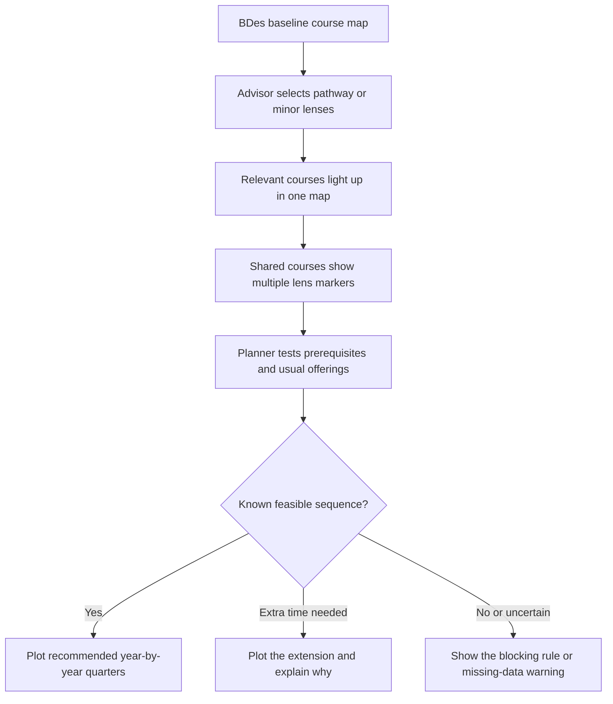

# Advisor-Led BDes Pathway Planner - Plan

## Goal Capsule

- **Objective:** Turn the existing Advising view into a visual BDes pathway and minor planner. An advisor selects one or more lenses, sees the relevant and shared courses light up, learns whether the combination is feasible, and receives a source-backed year-by-year course sequence.
- **Product authority:** This plan owns the Advising view only. The wider Program Command dashboard and tool review remains a set of separate follow-up planning areas.
- **Open blockers:** The department must reconcile current minor requirements and usual course-offering data before the planner can present an affected pathway as authoritative.

---

## Product Contract

### Summary

The Advising view will help an advisor explore the BDes curriculum without creating a student record. It will highlight courses for one or more selected pathway or minor lenses, expose overlap and conflicts, and plot the most feasible year-by-year sequence supported by known curriculum rules.

### Problem Frame

The current Program Command experience contains many dashboard and tool views whose purpose, data, calculations, and interactions need review. The immediate advising need is narrower than a full advising-record platform: during a conversation, an advisor needs to show how BDes requirements and optional interests fit together.

The existing lens model emphasizes a single track and minor, while the department treats every advised student as a BDes student who may explore several minors. Separate course lists make shared requirements hard to see and can make a combination look easier than it is. Advisors currently have to reconcile curriculum sheets, prerequisites, and usual offering patterns mentally.

### Actors and Authority

- A1. **Advisor:** Operates the planner, selects lenses, interprets warnings, and leads the advising conversation.
- A2. **Student:** Participates in the conversation and receives guidance, but does not edit or have an account in this release.
- A3. **Department curriculum owner:** Approves the source data used for pathway, minor, prerequisite, and usual-offering rules.

The planner is a department decision aid, not an official student record or a guarantee that a future section will run. DegreeWorks and other EWU systems retain their existing institutional authority.

### Key Decisions

- **Repair the existing Advising view first.** (session-settled: user-directed — chosen over beginning with a full-platform rebuild: the maintainer selected Advising as the first current view to fix.) Governs R1-R13.
- **Keep this release curriculum-only.** (session-settled: user-directed — chosen over a persistent student-record system: the requested value is pathway comparison and sequencing, and private records would require an internal service.) Governs R1, R10-R13.
- **Use BDes as the constant baseline with optional lenses.** (session-settled: user-directed — chosen over track-plus-one-minor categorization: all advised students are BDes students who may explore several interests.) Governs R1-R5.
- **Show one integrated course map.** (session-settled: user-directed — chosen over parallel pathway lanes: the selected visual direction uses one course sequence where shared courses remain visibly shared.) Governs R3-R6.
- **Explain feasibility instead of promising certainty.** The planner distinguishes a rule-backed conflict from missing or uncertain data. Governs R7-R9 and R12.
- **Plan other views separately.** (session-settled: user-approved — chosen over fixing every dashboard in one change: each current view should receive its own issue and focused planning session.) This keeps the active requirements limited to Advising.

<!-- ce-section: work-relationships -->
### How This Work Fits Together

This plan owns the Advising view. The broader list below preserves the current understanding of other Program Command views without making them requirements or a committed roadmap. Each area should receive a purpose-and-data audit, then its own plan or explicitly enumerated GitHub issue set.

- **Department view audit and issue map**
  - Enables the later areas by recording each view's user, decision, source, calculations, editable actions, broken states, overlaps, and disposition.
- **Enrollment**
  - Shares observed enrollment facts with Demand and Capacity.
- **Workload and Release Time**
  - Depends on Faculty Management and Applied Learning inputs.
  - Remains a high-priority independent planning session.
- **Capacity**
  - Depends on Enrollment, Demand, Workload, faculty availability, courses, and rooms.
- **Applied Learning**
  - Shares approved supervision and load effects with Workload.
- **Schedule Builder**
  - Still to decide whether to repair, absorb into another planning workflow, replace, or retire.
- **Course Management**
  - Enables Advising and scheduling through authoritative courses, prerequisites, caps, and usual offerings.
- **Department Onboarding**
  - Enables a new program to configure the minimum data and instructions needed by the other views.
- **EagleNET comparison**
  - Still to decide what decision it supports and whether it should remain a separate view.
- **Brains**
  - Can proceed independently after its inputs, instructions, permissions, and output boundaries are defined.
- **Demand**
  - Depends on observed Enrollment data and enables Capacity scenarios.
- **FLIX**
  - Can proceed independently as an algorithm-verification and later AI-assistance plan.
- **PAMCAM Lab**
  - Can proceed independently as its own product-planning area.
- **Faculty Management**
  - Enables Workload and Capacity through appointments, availability, and effective-dated release time.
- **Recommendations**
  - Depends on trusted inputs and a separately defined human decision boundary before any AI assistance is considered.

### Requirements

**Selection and course highlighting**

- R1. The Advising view always starts with the BDes requirements as the baseline and lets the advisor activate zero to three optional pathway or minor lenses.
- R2. The first-release optional lenses are Animation and Motion Design, Game Design, Graphic Design, Interaction Design, User Experience Design, Web Development, and Photography, with their course rules loaded from the department-approved advising source.
- R3. Activating a lens immediately highlights every course that contributes to it within one integrated curriculum view.
- R4. When two or more selected lenses use the same course, that course appears once and visibly identifies every selected lens it supports.
- R5. The view distinguishes BDes core courses, courses unique to one selected lens, courses shared by selected lenses, and courses that cannot currently be placed.
- R6. Removing a lens updates highlights and analysis without removing courses required by the BDes baseline or another active lens.

**Feasibility and sequencing**

- R7. The planner produces a recommended academic-year-and-quarter sequence using approved requirements, prerequisites, course ordering, and usual offering patterns.
- R8. The planner evaluates selected lenses together and identifies when the combination fits the normal planning horizon, requires extra time or unusual terms, or has no known valid sequence.
- R9. Every conflict names the cause that produced it, such as an unmet prerequisite chain, incompatible course timing, unavailable required term, or workload that exceeds the planner's approved limits.
- R10. Missing, stale, or contradictory source data produces an advisor-review warning and never becomes an unsupported claim that a combination is possible or impossible.

**Source transparency and boundaries**

- R11. Every pathway, minor, course match, prerequisite, usual offering, and planning limit is traceable to a named source version and review date.
- R12. The planner labels recommendations as planning guidance based on usual offerings, not a promise of future enrollment, capacity, or section availability.
- R13. The release does not collect student identity, completed coursework, grades, notes, transfer evaluations, or other student-specific information and does not require private record storage.

The integrated interaction has this shape:

### Key Flows

- F1. **Explore one lens**
  - **Trigger:** An advisor opens the Advising view and selects one pathway or minor.
  - **Actors:** A1
  - **Steps:** The BDes baseline remains visible; relevant courses light up; the view marks lens-only and shared BDes courses; the planner updates the recommended sequence.
  - **Outcome:** The advisor can explain what the lens adds and where it fits.
  - **Covers:** R1-R7, R11-R12.

- F2. **Compare several lenses**
  - **Trigger:** The advisor selects a second or third lens.
  - **Actors:** A1
  - **Steps:** The map keeps one occurrence per course, adds markers for every contribution, recalculates the combined sequence, and summarizes overlap.
  - **Outcome:** The advisor and student can see which courses do double duty and what additional coursework remains.
  - **Covers:** R1-R8, R11-R12.

- F3. **Explain a difficult combination**
  - **Trigger:** The selected lenses do not fit the normal horizon or rely on uncertain data.
  - **Actors:** A1, A3
  - **Steps:** The planner identifies the limiting rule, distinguishes extra-time from no-known-sequence and missing-data states, and displays the source behind the result.
  - **Outcome:** The advisor receives an explanation that can guide a different lens choice or a curriculum-data correction.
  - **Covers:** R7-R12.

- F4. **Return to the BDes baseline**
  - **Trigger:** The advisor clears all optional lenses.
  - **Actors:** A1
  - **Steps:** Optional highlights disappear; the BDes requirements and their recommended sequence remain.
  - **Outcome:** The advisor has a stable baseline for another comparison.
  - **Covers:** R1, R5-R7.

### Acceptance Examples

- AE1. **Single-lens highlighting**
  - **Covers R1-R7.**
  - **Given** the BDes baseline and one approved minor lens,
  - **When** the advisor activates that lens,
  - **Then** every contributing course highlights in the integrated map and the view shows the recommended sequence.

- AE2. **Visible overlap**
  - **Covers R1-R8.**
  - **Given** two selected lenses that share a course,
  - **When** the combined map renders,
  - **Then** the course appears once, identifies both contributions, and is not duplicated in the sequence.

- AE3. **Combination requires more time**
  - **Covers R7-R9 and R12.**
  - **Given** two selected lenses whose prerequisite and offering patterns exceed the normal horizon,
  - **When** the planner evaluates them together,
  - **Then** it plots the earliest known feasible extension and explains the limiting sequence.

- AE4. **No known valid sequence**
  - **Covers R7-R9.**
  - **Given** approved rules that cannot be satisfied together within the planner's supported terms and limits,
  - **When** the combination is evaluated,
  - **Then** the view says no known valid sequence exists and identifies each blocking rule.

- AE5. **Uncertain source data**
  - **Covers R10-R12.**
  - **Given** a required course with missing or contradictory prerequisite or offering information,
  - **When** the planner evaluates a lens that depends on it,
  - **Then** the result is advisor review required rather than possible or impossible.

- AE6. **No student record**
  - **Covers R13.**
  - **Given** any pathway comparison,
  - **When** the advisor changes lenses or leaves the view,
  - **Then** no student identity, course history, grade, note, or transfer decision has been requested or stored.

### Success Criteria

- An advisor can answer, from one view, which courses a selected lens adds, which courses several lenses share, and what the combined sequence looks like.
- Every infeasible, extended, or uncertain result includes a reason the advisor can explain.
- All selectable lenses and course rules are reconciled against approved current sources before they are labeled authoritative.
- The core planner can operate without an internal student-record service.

### Scope Boundaries

**In scope**

- The existing Advising view.
- BDes baseline plus zero to three optional pathway or minor lenses.
- Integrated course highlighting, overlap, source-backed feasibility analysis, and year-by-year quarter sequencing.
- Generic curriculum scenarios without student identity.

**Deferred for separate work**

- Student-specific completed courses, grades, transfer credit, substitutions, notes, saved plans, or advising history.
- Shareable student summaries, printable checklists, DegreeWorks follow-up, or automated DegreeWorks exchange.
- Live seats, registration eligibility, faculty workload, room capacity, and guaranteed future section availability.
- The other dashboard and tool views listed under How This Work Fits Together.

**Outside this release's identity**

- An official student-record system.
- Autonomous advising decisions or guarantees that a future schedule will be available.
- A private-server, authentication, or production-database project.

### Dependencies and Assumptions

- The department can approve a current BDes and minor source set, including course membership and credit requirements.
- The repository's prerequisite and usual-offering information can be reconciled well enough to support explainable sequencing.
- “Normal planning horizon” and “approved limits” must come from department rules rather than an arbitrary algorithmic default.
- Course availability remains probabilistic; the planner reports the pattern and its as-of date.

### Sources and Evidence

- [2026-27 advising worksheet](https://docs.google.com/spreadsheets/d/1tJwjdML9tIpCbqfvpuJ1Wr7IgOO1VYAWXEZaMtCpvO4/edit?usp=sharing) — working pathway and minor source supplied by the maintainer.
- [EWU Bachelor of Design catalog](https://catalog.ewu.edu/stem/design/design-bdes/) — current BDes requirements.
- [EWU Animation and Motion Design minor](https://catalog.ewu.edu/stem/design/animation-motion-design-minor/) — current official minor page; it must be reconciled with the worksheet's different credit total.
- [EWU Web Development minor](https://catalog.ewu.edu/stem/design/web-development-minor/) — current official minor page; it must be reconciled with the worksheet's course-code discrepancy.
- Maintainer-provided 2026-27 BDes and SFCC advising checklist HTML files — existing advising patterns reviewed for context; student-record behavior from those files is not part of this release.
- Existing Program Command pathway, prerequisite, usual-offering, and course-recommendation data — planning must verify which parts are current enough to reuse.
