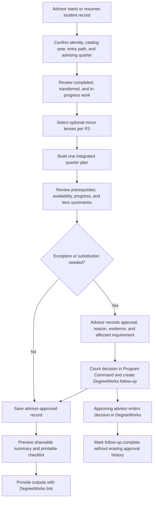

# Advisor-Led BDes Advising - Plan

## Goal Capsule

Create one advisor-led Program Command workspace for EWU Bachelor of Design students that combines degree progress, quarter planning, and several optional minor lenses without duplicating courses or credits. Program Command is the official departmental advising record; DegreeWorks remains the official university record. The advisor owns the advising session, any departmental approval, and any required DegreeWorks follow-up.

The requirements are ready for implementation planning. Before the feature can produce authoritative degree calculations, the implementation team must reconcile the current advising worksheet with official catalog and articulation sources, including the `DESN 469` versus `DESN 4699` discrepancy described below.

---

## Product Contract

### Summary

The advising workspace replaces separate static checklists with a persistent, advisor-operated student record. Every student in this workspace is pursuing the BDes. Optional minors do not create separate student types; they act as advising lenses that reveal how the same planned courses contribute to additional goals.

An advisor can view one integrated quarter plan, activate several minor lenses, record completed and transferred work, document department-approved exceptions, and produce both a shareable advising summary and a printable checklist. Each planned course occurrence appears only once, while distinct attempts remain distinct. One occurrence can satisfy multiple authorized categories, but its earned credits count only once toward degree totals.

### Problem Frame

The current Program Command lens control supports one track and one minor at a time, while the live 2026-27 advising worksheet describes seven minors and the department wants students to consider several of them together. The repository has pathway, prerequisite, course-offering, and graduation-planning logic, but it does not have an individual advising record, student progress model, DegreeWorks follow-up workflow, or advising-specific authorization boundary.

The two maintainer-provided HTML checklists demonstrate useful native-BDes and SFCC-transfer advising patterns, but they are independent files with browser-local save/load behavior. Advisors need those strengths in one durable departmental system without implying that Program Command directly updates DegreeWorks.

### Actors and Authority

- Advisor: the authenticated department user who opens or creates the record, leads the advising session, plans coursework, records evidence, approves department exceptions, and completes any corresponding DegreeWorks entry.
- Student: the subject of the advising record and recipient of the advisor-approved summary and checklist; student self-service editing is not part of this release.
- Program Command: the official departmental advising record and the immediate source of department-approved planning decisions.
- DegreeWorks: the official EWU degree-audit record. Program Command links to it but does not automate or claim to replace it.

### Key Decisions

- **Advising-first scope.** (session-settled: user-directed — chosen over beginning with a full-platform audit: the maintainer explicitly selected advising first.) Governs R1-R18.
- **Advisor-led authority.** (session-settled: user-directed — chosen over student-led planning: the department's advising process is led and made official by an advisor.) Governs R1, R8-R12, R16, and R17.
- **BDes identity with optional minor lenses.** (session-settled: user-directed — chosen over the existing track-plus-minor model: all advised students are BDes students who may explore several minors.) Governs R2-R6.
- **One integrated planning surface.** (session-settled: user-directed — chosen over parallel lanes and compare-first concepts: the maintainer selected the integrated visual direction.) Governs R5-R7.
- **Multi-lens advising sessions.** (session-settled: user-directed — chosen over a single-minor selector: advisors need to examine several minor paths together.) Governs R3, R5, R6, R9, R14, and R15.
- **Department approval with advisor-owned DegreeWorks follow-up.** (session-settled: user-approved — chosen over note-only exceptions or no exception mechanism: the maintainer confirmed advisor approval as the department's official decision.) Governs R8-R13.
- **Summary and checklist outputs.** (session-settled: user-directed — chosen over either output alone: the maintainer selected both forms with a DegreeWorks link.) Governs R13-R16.
- **Native BDes and SFCC as the first named entry paths.** Other transfer cases remain advisor-managed until separately defined. Governs R2 and R15.
- **Versioned curriculum authority.** The live worksheet is a working source rather than sufficient authority by itself. Governs R1, R4, R7, and R18.

<!-- ce-section: work-relationships -->
### How This Work Fits Together

This advising plan is the first focused plan in a larger department-level Program Command review. It depends on existing course, prerequisite, quarter, availability, pathway, and authentication foundations, but it does not silently broaden those modules into a full platform redesign. The breakdown below is the current planning context, not a committed roadmap; a later plan may revise, split, merge, or retire a candidate.

Each feature candidate should receive its own brainstorm and accepted requirements plan before implementation issues are created. That preserves the work without requiring the maintainer to remember it.

- **Department product audit and planning map.** Still to decide: inventory every Dashboard and Tools screen, owner, source, supported decision, overlap, dead end, and trust gap; then recommend the durable information architecture and planning order.
- **Enrollment.** Shares observed enrollment facts with Demand and Capacity; validate definitions, filters, trends, editable fields, source quality, refresh cadence, and scheduling connections.
- **Workload and Release Time.** Depends on effective-dated inputs from Faculty Management and Applied Learning; run the requested deep planning session for policy, calculations, teaching assignments, approved release-time effects, overloads, scenarios, auditability, and outputs.
- **Capacity.** Depends on Enrollment, Demand, Faculty Management, Workload, course, and room inputs; revalidate bottlenecks, calculations, scenarios, and decision ownership.
- **Applied Learning.** Shares approved load effects with Workload; own and audit student activity, supervision, approvals, outcomes, and reporting for internships, practica, and independent study.
- **Schedule Builder.** Still to decide: retain it, absorb it into an integrated planning workflow, replace it, or retire it based on the chair or advisor decision it should support.
- **Course Management.** Enables scheduling and advising; define authoritative course inventory, additions, deletions, caps, quarter availability, bulk changes, validation, permissions, history, and new-program instructions.
- **Department Onboarding.** Enables new programs; define the minimum manual workflow, required source files, instructions, validation gates, and whether bounded AI assistance adds value without making an AI backend mandatory.
- **EagleNET purpose and disposition.** Still to decide: re-establish its intended decision and sources, then explicitly keep, absorb, replace, or retire it.
- **Brains.** Can proceed independently after its inputs and authority are known; preserve the promising concept while defining purpose, instructions, permissions, outputs, provenance, and safe decision boundaries.
- **Demand.** Depends on observed Enrollment data and enables Capacity scenarios; overhaul its forecast model, horizon, confidence, explanations, scenarios, and safe decisions.
- **FLIX.** Can proceed independently as a verification plan; validate the deterministic algorithm first, then decide where explainable AI adds value and how to evaluate it.
- **PAMCAM Lab.** Can proceed independently as its own product plan; define users, decisions, inputs, methods, outputs, governance, and connections to curriculum or scheduling.
- **Faculty Management.** Enables Workload and Capacity; own appointments, roles, availability, approved release-time allocations, effective dates, approvals, and midyear changes.
- **Recommendations.** Depends on trusted source data and explicit human authority; define supported decisions, explanations, evaluation, and whether an AI service is warranted.

The department product audit should set the order after advising. Workload remains a high-priority independent planning session, not a subsection of another plan.

### Requirements

**Student and curriculum context**

R1. Each advising record must store the student's name, EWU identifier, assigned or acting advisor, pinned catalog year, entry path, current quarter, and advising quarter.

R2. The first release must provide named starting contexts for native BDes students and students entering through the supplied SFCC Graphic Design articulation. Selecting an articulation context loads a requirements template; it does not award a student credit. No transfer course or credit counts as completed until the advisor records the student-specific accepted transfer evaluation, its evidence, and its as-of date. An advisor must be able to record transfer work and exceptions for other students without presenting those cases as a validated named articulation path.

R3. Every advising record must represent the BDes as the primary program and allow the advisor to activate zero to three optional minor lenses. For the 2026-27 working source, the selectable lenses are Animation and Motion Design, Game Design, Graphic Design, Interaction Design, User Experience Design, Web Development, and Photography.

The working 2026-27 lens roster tied to R3 is:

| Minor lens | Working credit total |
| --- | ---: |
| Animation and Motion Design | 45 |
| Game Design | 30 |
| Graphic Design | 15 |
| Interaction Design | 30 |
| User Experience Design | 15 |
| Web Development | 20 |
| Photography | 25 |

Exact course membership must come from the reconciled, versioned curriculum source required by R18 rather than a second hand-maintained copy of the worksheet.

R4. The record must pin the catalog year and the version or effective date of every curriculum source used in its calculations. A later source update must not silently rewrite an existing student's requirements, decisions, or historical output. Moving an existing record to a newer source version requires an authorized advisor to review and approve the migration, see its before-and-after effects, and preserve the prior versions in history.

**Integrated advising workspace**

R5. The advisor must work from one integrated quarter-by-quarter course plan. Each planned course occurrence or recorded attempt must appear once and may display multiple requirement or lens badges rather than being copied into parallel minor plans. Retakes and repeatable-course attempts remain distinct and follow the applicable catalog repeat-credit rules.

R6. When official rules allow one course occurrence to satisfy more than one categorical requirement or minor lens, the workspace must show each satisfied category while counting that occurrence's earned credits only once toward degree totals. For every active lens, the workspace must summarize completed, in-progress, planned, and remaining requirements and credits while shared courses remain single entries in the integrated plan.

R7. The workspace must evaluate known prerequisites, usual-quarter availability, and source-backed pathway constraints. Every warning must identify its source and distinguish a hard rule from a condition requiring advisor review.

R8. The advisor must be able to record completed EWU work, accepted transfer work, planned work, and documented substitutions or exceptions. Free-form overrides without an accountable decision record are not allowed.

R9. The advising record must be persistent and resumable. It must retain the course plan, active lenses, source versions, advisor decisions, and audit history across sessions.

**Department approval and DegreeWorks follow-up**

R10. A department-approved substitution or exception must record the approving advisor, approval date, reason, affected course or requirement, and the evidence or context needed to understand the decision later.

R11. Once the advisor approves an exception, Program Command must apply it immediately to departmental progress calculations and display `Approved — DegreeWorks entry pending`. The follow-up is assigned to the approving advisor.

R12. The approving advisor must be able to mark the DegreeWorks entry complete with a completion date. Completion must append to, not replace, the original approval history.

R13. The workspace and both student-facing outputs must clearly explain that Program Command is the official departmental advising record while DegreeWorks is the official EWU record. They must provide a direct DegreeWorks link without implying an automated data exchange.

**Outputs, access, and governance**

R14. The advisor must be able to preview and create a shareable advising summary containing student and advisor identity, advisor approval date, generated and record-as-of dates, catalog and source versions, entry context, current progress, selected lenses, the agreed quarter plan, unresolved warnings, department approvals, DegreeWorks follow-up status, and the DegreeWorks link.

R15. The advisor must also be able to preview and print a checklist containing the same authoritative decisions and freshness metadata in a compact completion-oriented format. For the named SFCC path, it must show the validated transfer, remaining-major, upper-division, total-credit, and EWU-residency assumptions applicable to that articulation without representing template credits as student-completed work.

R16. Only an advisor-approved output may be shared. The release must not expose a public, unauthenticated student record or give a recipient an editing path.

R17. Only authorized department advisors may view or edit advising records. Student identity, course history, notes, approvals, and outputs must follow the repository's authenticated department-access model.

R18. Every progress total, requirement match, articulation assumption, and warning must be traceable to a named, versioned source. An unresolved mismatch between working data and an authoritative source must block authoritative release of the affected calculation rather than being resolved silently.

### Advising Flow

### Key Flows

F1. **Start or resume advising.** The advisor finds or creates the student, verifies catalog and entry context, reviews source provenance, and resumes the latest departmental record. Covers R1-R4, R9, and R17-R18.

F2. **Plan an advising quarter.** The advisor chooses zero to three lenses, works in one course plan, reviews transparent progress and warnings, and saves the agreed plan. Covers R3 and R5-R9.

F3. **Approve and reconcile an exception.** The advisor records a department decision, sees it count immediately with DegreeWorks pending, enters it in DegreeWorks, and closes the follow-up while retaining the audit trail. Covers R8-R13.

F4. **Share the advising result.** The advisor previews both outputs, confirms the record, and provides a read-only summary and printable checklist that distinguish departmental and university records. Covers R13-R17.

### Acceptance Examples

AE1. **Multiple lenses with one course occurrence.** An advisor activates Interaction Design, User Experience Design, and Web Development. One planned course occurrence that officially applies to all three appears once with three badges, satisfies all permitted categories, and contributes its credits only once to the degree total. A later retake remains a separate attempt governed by the catalog's repeat-credit rule. Each lens summary shows its own completed, in-progress, planned, and remaining work. Covers R3, R5, and R6.

AE2. **BDes-only advising.** An advisor selects no minor lens. The workspace remains a complete BDes advising tool and does not require the student to declare or choose a minor. Covers R3, R5, and R6.

AE3. **Explain a planning warning.** An advisor plans a course before its unmet prerequisite or in a quarter when the source says it is not normally offered. The workspace identifies the relevant source and explains whether the condition blocks the plan or needs advisor review. Covers R7 and R18.

AE4. **Approve and reconcile a substitution.** An advisor approves a substitution. The departmental calculation updates immediately, the record shows `Approved — DegreeWorks entry pending`, and the approving advisor owns the task. When that advisor records completion, both the approval and completion events remain visible. Covers R8 and R10-R13.

AE5. **Begin from the SFCC articulation.** An advisor selects the named SFCC entry path. The record loads the validated articulation template but awards no completed credit until the advisor records the student's accepted transfer evaluation and evidence. It then makes remaining major, upper-division, total-credit, and EWU-residency progress visible; it does not infer that an unvalidated transfer path has the same rules. Covers R2, R8, R15, and R18.

AE6. **Preserve a historical source version.** Curriculum source data changes after an advising session. The existing record retains its pinned catalog and source versions, and the advisor is offered an explicit reviewed migration rather than receiving silently changed calculations. Covers R4 and R18.

AE7. **Generate both dated outputs.** The advisor previews a summary and checklist. Both contain their freshness metadata, the agreed plan, approvals, pending DegreeWorks work, and a DegreeWorks link; neither exposes an editable or unauthenticated student record. Covers R13-R16.

AE8. **Enforce advisor access.** An authorized advisor can list, retrieve, edit, approve, and generate outputs for advising records within the department-access boundary. A signed-out user and an authenticated user without the advisor capability can do none of those actions, including retrieving a record or output by a known identifier. Covers R16 and R17.

### Success Criteria

- An authorized advisor can complete F1-F4 without returning to either standalone HTML checklist.
- One course occurrence is never duplicated in the integrated plan, distinct attempts remain distinct, and no occurrence's earned credits are counted twice toward the degree total.
- Active minor lenses per R3 produce understandable, source-backed summaries without changing the student's BDes identity.
- Every department exception has an accountable approval and an independently visible DegreeWorks completion state.
- Native BDes and SFCC advising calculations pass against reconciled, versioned sources before being represented as authoritative.
- Both advisor-approved outputs contain enough context for the student and a later advisor to understand the plan and record authority.

### Scope Boundaries

Included per R1-R18:

- Advisor-led BDes progress and quarter planning.
- Zero to three simultaneous optional minor lenses.
- Native BDes and the supplied SFCC articulation as the first named entry paths.
- Department exception approval and manual DegreeWorks follow-up.
- A shareable summary and printable checklist.

Deferred to later advising plans or implementation decisions:

- Additional named transfer and articulation paths.
- Automated DegreeWorks, EagleNET, SIS, or transcript synchronization.
- Importing historical JSON files produced by the two standalone checklists.
- A curriculum-rule editor or department onboarding workflow.
- AI-generated recommendations or automatic exception decisions.

Outside this feature:

- Student self-service planning or editing.
- Every follow-on candidate captured in How This Work Fits Together.

### Dependencies and Assumptions

A1. The live 2026-27 advising worksheet is the current working source for the seven minor lenses, but exact requirements must be reconciled with the official EWU catalog and approved articulation sources.

A2. The worksheet says BDes students are not required to declare a minor and identifies a 2.5 GPA expectation for minor coursework. Both behaviors must be confirmed against the governing source and then represented without turning a lens into a separate student program identity.

A3. The worksheet's Web Development minor lists `DESN 469`, while the degree-elective portion contains `DESN 4699`. That difference must be resolved with an authoritative source before the affected calculation ships.

A4. The native-BDes prototype's working assumptions include 180 total credits, 60 upper-division credits, a 2.0 overall GPA, a 2.5 major GPA, and 95 major credits. They remain provisional until verified against the pinned catalog year.

A5. The SFCC transfer prototype's working assumptions include 90 transfer credits, 180 total credits, 50 upper-division credits, 45 EWU-residency credits, and 50 remaining major credits at EWU. They remain provisional until verified against the active agreement and catalog year.

A6. Existing prerequisite, quarter, availability, pathway, and recommendation logic is a reusable foundation, not a substitute for the student advising record or source reconciliation.

A7. Implementation planning must identify the repository's authoritative advisor-role mapping, protected persistence model, retention expectations, and approved DegreeWorks destination link.

### Outstanding Questions

#### Resolve Before Planning

None.

#### Deferred to Planning

- What read-only delivery mechanism should the shareable advising summary use?
- Should existing standalone-checklist JSON records be migrated, attached as evidence, or left as historical files?
- Which existing authenticated department roles map to advisor view, edit, and approval capabilities?
- How will reconciled catalog and articulation sources be published, versioned, and reviewed before calculations become authoritative?

---

## Sources and Evidence

Repository evidence reviewed on 2026-08-05:

- `js/components/lens-filters.js` — current scalar one-track and one-minor selection behavior.
- `program-command.html` — current lens integration and single-minor highlighting.
- `data/pathways.json` — existing pathway/minor data, which differs from the live worksheet.
- `js/data-models.js` and `js/db-service.js` — current pathway model and access layer.
- `js/graduation-optimizer.js` — reusable quarter, prerequisite, availability, pathway, and minor reasoning.
- `js/course-recommender.js` — reusable quarter and pathway/minor matching logic.
- `docs/scheduling-data-gaps.md` — explicit absence of individual completion, declaration, and graduation-timeline data.
- `department-profiles/design-v1.json` — current default Design dashboard module configuration, which does not include advising.

Maintainer-provided references reviewed on 2026-08-05:

- `vcd-advising-checklist-2026-27_2.html` — native BDes checklist and three-year planning reference.
- `vcd-transfer-sfcc-checklist.html` — SFCC articulation checklist and two-year planning reference.
- [Copy of 2026-27 VCD Advising Sheet](https://docs.google.com/spreadsheets/d/1tJwjdML9tIpCbqfvpuJ1Wr7IgOO1VYAWXEZaMtCpvO4/edit?usp=sharing) — ranges `Minors!A1:E49` and `University+Major Reqs!A1:E52`, read on 2026-08-05.
