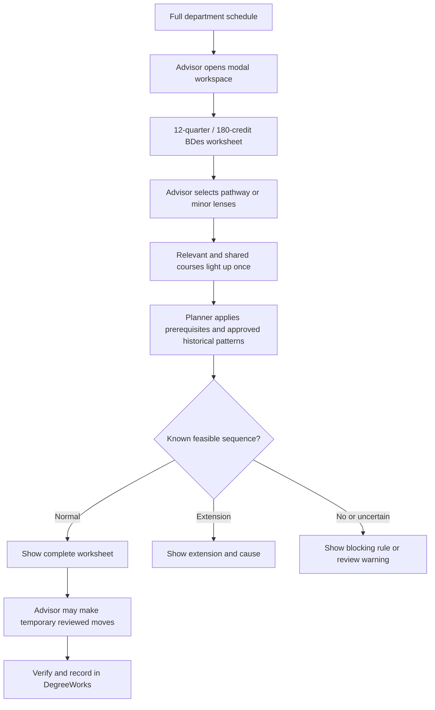
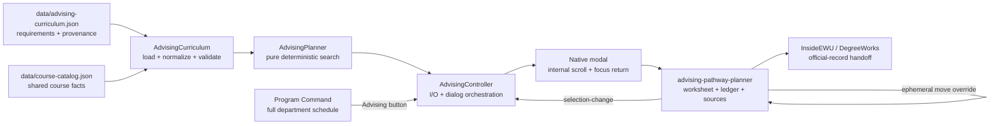

# Advisor-Led BDes Pathway Planner - Plan

## Goal Capsule

- **Objective:** Add an advisor-led Advising workspace over the full Program Command schedule. An advisor starts from a complete 12-quarter, 180-credit BDes worksheet, selects zero to three optional lenses, sees relevant and shared courses light up, and explores a source-backed sequence without changing the department schedule or creating a student record.
- **Product authority:** This plan owns the Advising view and issue #275 only. Dashboard cleanup is tracked by issue #274 and its linked child issues.
- **Authority hierarchy:** Session-settled product decisions outrank this plan. The current EWU catalog owns published requirements. The department worksheet owns advising framing when it does not conflict with the catalog. Curriculum-owner-approved normal historical patterns supply hard planning constraints; observed exceptions remain evidence and do not silently change those patterns.
- **Execution profile:** Implement one isolated vertical slice on `codex/advising-v1`, verify it locally, and deliver it through a focused pull request against `main`.
- **Stop conditions:** Stop if the work would store student data, claim institutional double-counting, hide a source conflict, modify a forbidden path, deploy, or mutate production services.
- **Tail ownership:** The executing `ce-work` run owns implementation, review, CI repair, and landing under the repository's standing delivery policy.

---

## Product Contract

### Summary

The Advising workspace will help an advisor explore a generic 2026–27 BDes curriculum scenario without creating a student record. It opens as a modal over the full department schedule, keeps a complete 12-quarter and 180-credit worksheet visible with zero to three optional pathway or minor lenses, and exposes source-level overlap, credit placeholders, constraints, and conflicts. DegreeWorks remains the official EWU student record; the advisor verifies and records the student-specific plan there.

### Problem Frame

The current Program Command experience contains many dashboard and tool views whose purpose, data, calculations, and interactions need review. The immediate advising need is narrower than a full advising-record platform: during a conversation, an advisor needs to show how BDes requirements and optional interests fit together.

The existing lens model emphasizes a single track and minor, while the department treats every advised student as a BDes student who may explore several minors. Separate course lists make shared requirements hard to see and can make a combination look easier than it is. Advisors currently have to reconcile the 180-credit degree frame, the 60-credit upper-division requirement, general education, BDes electives, prerequisites, and historical offering patterns mentally.

### Actors and Authority

- A1. **Advisor:** Operates the planner, selects lenses, interprets warnings, and leads the advising conversation.
- A2. **Student:** Participates in the conversation and receives guidance, but does not edit or have an account in this release.
- A3. **Department curriculum owner:** Approves the repository snapshot used for pathway, minor, prerequisite, historical-offering-pattern, and planning-assumption rules. Approval and correction happen outside the application and are recorded by source version, reviewer, and review date before a warning is cleared.

The planner is the department's advisor-led curriculum planning aid. DegreeWorks remains the official EWU student-specific record, and future course sections are never guaranteed.

### Key Decisions

- **Repair Advising first.** (session-settled: user-directed — chosen over beginning with a full-platform rebuild: the maintainer selected Advising as the first current workspace to fix.) Governs R1-R25.
- **Keep this release curriculum-only.** (session-settled: user-directed — chosen over a persistent student-record system: the requested value is pathway comparison and sequencing, and private records would require an internal service.) Governs R1, R10-R15, R19-R24.
- **Use BDes as the constant baseline with optional lenses.** (session-settled: user-directed — chosen over track-plus-one-minor categorization: all advised students are BDes students who may explore several interests.) Governs R1-R6.
- **Show one integrated course map.** (session-settled: user-directed — chosen over parallel pathway lanes: the selected visual direction uses one course sequence where shared courses remain visibly shared.) Governs R3-R6.
- **Explain feasibility instead of promising certainty.** The planner distinguishes a rule-backed conflict from missing or uncertain data. Governs R7-R10 and R12.
- **Link out for the student-specific record.** (session-settled: user-directed — chosen over storing student records in Program Command: the advisor uses DegreeWorks for the official student-specific audit.) Governs R13-R14.
- **Keep the department schedule primary.** (session-settled: user-directed — chosen over embedding the full worksheet in the schedule page: Advising opens only when requested and closes back to the unchanged schedule.) Governs R23.
- **Let advisors explore placement without saving it.** (session-settled: user-directed — chosen over schedule or student-plan persistence: drag and keyboard moves are temporary and visibly require review.) Governs R24.
- **Plan other views separately.** (session-settled: user-approved — chosen over fixing every dashboard in one change: each current view should receive its own issue and focused planning session.) This keeps the active requirements limited to Advising.

<!-- ce-section: work-relationships -->
### How This Work Fits Together

This plan owns the Advising view. The broader list below preserves the current understanding of other Program Command views without making them requirements or a committed roadmap. Each area should receive a purpose-and-data audit, then its own plan or explicitly enumerated GitHub issue set.

- **Department view audit and issue map**
  - Enables the later areas by recording each view's user, decision, source, calculations, editable actions, broken states, overlaps, and disposition.
- **Enrollment**
  - Shares observed enrollment facts with Demand and Capacity.
- **Workload and Release Time**
  - Depends on Faculty Management and Applied Learning inputs.
  - Remains a high-priority independent planning session.
- **Capacity**
  - Depends on Enrollment, Demand, Workload, faculty availability, courses, and rooms.
- **Applied Learning**
  - Shares approved supervision and load effects with Workload.
- **Schedule Builder**
  - Still to decide whether to repair, absorb into another planning workflow, replace, or retire.
- **Course Management**
  - Enables Advising and scheduling through authoritative courses, prerequisites, caps, and approved historical offering patterns.
- **Department Onboarding**
  - Enables a new program to configure the minimum data and instructions needed by the other views.
- **EagleNET comparison**
  - Still to decide what decision it supports and whether it should remain a separate view.
- **Brains**
  - Can proceed independently after its inputs, instructions, permissions, and output boundaries are defined.
- **Demand**
  - Depends on observed Enrollment data and enables Capacity scenarios.
- **FLIX**
  - Can proceed independently as an algorithm-verification and later AI-assistance plan.
- **PAMCAM Lab**
  - Can proceed independently as its own product-planning area.
- **Faculty Management**
  - Enables Workload and Capacity through appointments, availability, and effective-dated release time.
- **Recommendations**
  - Depends on trusted inputs and a separately defined human decision boundary before any AI assistance is considered.

### Requirements

**Selection and course highlighting**

- R1. The Advising view always starts with the BDes requirements as the baseline and lets the advisor activate zero to three optional pathway or minor lenses.
- R2. The first-release optional lenses are Animation and Motion Design, Game Design, Graphic Design, Interaction Design, User Experience Design, Web Development, and Photography. All seven load through the source registry; a lens with unresolved or unapproved rules remains selectable but is visibly labeled `advisor-review-required` before selection and in every combined result.
- R3. Activating a lens immediately highlights every course that contributes to it within one integrated curriculum view.
- R4. When two or more selected lenses use the same course, that course appears once and visibly identifies every selected lens it supports.
- R5. The view distinguishes BDes core courses, BDes elective placeholders, open-degree placeholders, general-education placeholders, courses unique to one selected lens, shared courses, and items that cannot currently be placed.
- R6. Removing a lens updates highlights and analysis without removing courses required by the BDes baseline or another active lens.

**Feasibility and sequencing**

- R7. The planner produces a complete Fall-start, 12-quarter worksheet totaling 180 modeled credits from named coursework and explicit credit placeholders, using prerequisites, course ordering, and approved historical offering patterns.
- R8. The planner evaluates selected lenses across twelve normal Fall/Winter/Spring terms and up to six additional extension terms at no more than 15 total modeled credits per term. Summer and other non-standard terms are not searched in v1, and the ledger names that boundary when it affects the result.
- R9. Every conflict names the cause that produced it, such as an unmet prerequisite chain, incompatible approved offering pattern, unavailable required term, or load beyond the planner's approved limit.
- R10. Missing, stale, contradictory, unapproved, ambiguous, unparsed, conditional, or unsupported source rules produce an advisor-review warning and never become an unsupported claim that a combination is possible or impossible. If any selected lens has such a rule, the combined status is `advisor-review-required` and names that lens while retaining a clearly non-authoritative sequence preview when one can be calculated.

**Source transparency and boundaries**

- R11. Every pathway, minor, course match, prerequisite, approved historical offering pattern, observed exception, and planning limit is traceable to a repository snapshot record containing a source ID, URL or repository path, catalog or data version, capture date, reviewer, review date, and explicit review state.
- R12. The planner labels recommendations as planning guidance based on approved normal historical patterns, not a promise of future enrollment, capacity, or section availability.
- R13. The release does not collect student identity, completed coursework, grades, notes, transfer evaluations, or other student-specific information and does not require private record storage.
- R14. The view provides an **Open InsideEWU for DegreeWorks** link to `https://inside.ewu.edu/` in a new tab with safe external-link attributes so the advisor can verify and enter the official student-specific record outside Program Command.
- R15. Every result identifies the generic 2026–27 model, the 180-credit target, the 60-credit upper-division boundary, modeled inputs and exclusions, the governing catalog year, and the offering-evidence as-of date. It directs the advisor to verify the student's applicable catalog year, categories, and audit in DegreeWorks.
- R16. Shared-course markers mean that a course appears in multiple source curricula; the overlap display and elective-credit total explicitly say they do not guarantee institutional double-counting for an individual student.
- R17. For every `choose-N` or either/or group, the view distinguishes required courses, planner-selected provisional alternatives, and remaining approved alternatives, with the governing source visible.
- R18. A source-conflict ledger item identifies the responsible curriculum owner, the exact source and rule, and the approval needed. It is cleared only after a repository update records the approved version, reviewer, and review date.

**Complete degree worksheet**

- R19. The degree model represents all eleven advising-sheet requirements: English composition, English analysis/research, Mathematics, two Humanities and Arts slots, two Natural Sciences slots, two Social Sciences slots, Diversity, and Global Studies. DESN 200 may satisfy one Humanities and Arts slot, and DESN 359 may satisfy Diversity; one named course can satisfy at most one placeholder slot.
- R20. The worksheet renders remaining BDes elective credits as **BDes elective slot** placeholders and credits still needed to reach 180 as separate **Open degree credit** placeholders. It never invents a specific elective course.
- R21. Placeholder and open-degree cards reserve credit space but do not prove the 60 upper-division-credit requirement or an official general-education category. The view gives that boundary near the worksheet and sends verification to DegreeWorks.
- R22. An approved normal historical offering pattern is a hard placement constraint; a missing, unresolved, stale, or unapproved pattern follows R10. The chair-facing causal warning appears only when the approved rotation itself prevents normal 12-quarter completion and identifies the affected courses.

**Workspace interaction**

- R23. A clear **Advising** button opens the planner as an accessible modal workspace over Program Command, leaving the full department schedule as the primary uninterrupted page. The workspace has an obvious Close action, an internal scroll region, Escape behavior, focus return, a generous desktop layout, and a chronological full-screen narrow layout with no page-level horizontal scrolling.
- R24. Placed or unplaced named-course and placeholder cards support temporary drag-and-drop into quarters plus keyboard-accessible Move or Place controls. A manual move is never persisted or silently revalidated; the view flags advisor review and names an unsupported target quarter when it conflicts with the course's approved historical pattern.
- R25. The source register is collapsed by default behind a chair-facing control labeled **Data sources** while retaining traceable source/version details when opened.

The integrated interaction has this shape:

### Key Flows

- F1. **Explore one lens**
  - **Trigger:** An advisor opens the Advising modal from the department schedule and selects one pathway or minor.
  - **Actors:** A1
  - **Steps:** The complete 180-credit BDes worksheet remains visible; relevant courses light up; the view marks lens-only and shared BDes courses; the planner updates the sequence without changing the department schedule.
  - **Outcome:** The advisor can explain what the lens adds and where it fits.
  - **Covers:** R1-R3, R5, R7, R11-R12, R19-R23.

- F2. **Compare several lenses**
  - **Trigger:** The advisor selects a second or third lens.
  - **Actors:** A1
  - **Steps:** The map keeps one occurrence per course, adds markers for every contribution, recalculates the combined sequence, and summarizes overlap.
  - **Outcome:** The advisor and student can see source-level course overlap and what additional coursework remains, without treating that overlap as an official double-counting decision.
  - **Covers:** R1-R8, R11-R12, R19-R22.

- F3. **Explain a difficult combination**
  - **Trigger:** The selected lenses do not fit the normal horizon or rely on uncertain data.
  - **Actors:** A1, A3
  - **Steps:** The planner identifies the limiting rule, distinguishes extra-time from no-known-sequence and missing-data states, and displays the source behind the result. A historical-rotation warning appears only when the approved pattern itself blocks normal completion. For a source correction, the ledger identifies the curriculum owner, exact conflicted rule, and approval metadata required.
  - **Outcome:** The advisor receives an explanation that can guide a different lens choice or an out-of-app curriculum-data correction.
  - **Covers:** R7-R12, R18, R21-R22.

- F4. **Return to the BDes baseline**
  - **Trigger:** The advisor clears all optional lenses.
  - **Actors:** A1
  - **Steps:** Optional highlights disappear; fixed BDes requirements and all eleven degree requirement slots remain; unresolved BDes electives and residual degree credits appear as distinct placeholders rather than invented course choices.
  - **Outcome:** The advisor has a complete generic 12-quarter, 180-credit BDes worksheet for another comparison.
  - **Covers:** R1, R5-R8, R19-R21.

- F5. **Explore a temporary placement**
  - **Trigger:** An advisor drags a card or uses its keyboard Move control.
  - **Actors:** A1
  - **Steps:** The card moves in component memory; the generated status is qualified; the view flags unsaved constraint review and names the target quarter when it is outside the approved historical pattern.
  - **Outcome:** The advisor can discuss an alternative layout without changing the generated result, the department schedule, or an official record.
  - **Covers:** R12-R14, R22-R24.

### Acceptance Examples

- AE1. **Single-lens highlighting**
  - **Covers R1-R3, R5, R7, and R23.**
  - **Given** the full department schedule and one approved minor lens,
  - **When** the advisor opens Advising and activates that lens,
  - **Then** every contributing course highlights in the modal's complete worksheet while the schedule remains unchanged.

- AE2. **Visible overlap**
  - **Covers R1-R8.**
  - **Given** two selected lenses that share a course,
  - **When** the combined map renders,
  - **Then** the course appears once, identifies both contributions, and is not duplicated in the sequence.

- AE3. **Combination requires more time**
  - **Covers R7-R9, R12, and R22.**
  - **Given** two selected lenses whose prerequisite and offering patterns exceed the normal horizon,
  - **When** the planner evaluates them together,
  - **Then** it plots the earliest known feasible extension and explains the limiting sequence.

- AE4. **No known valid sequence**
  - **Covers R7-R9.**
  - **Given** approved rules that cannot be satisfied together within the planner's supported terms and limits,
  - **When** the combination is evaluated,
  - **Then** the view says no known valid sequence exists and identifies each blocking rule.

- AE5. **Uncertain source data**
  - **Covers R10-R12.**
  - **Given** a required course with missing or contradictory prerequisite or offering information,
  - **When** the planner evaluates a lens that depends on it,
  - **Then** the result is advisor review required rather than possible or impossible.

- AE6. **No student record**
  - **Covers R13 and R24.**
  - **Given** any pathway comparison,
  - **When** the advisor changes lenses, manually moves cards, or leaves the view,
  - **Then** no selection, move, student identity, course history, grade, note, or transfer decision has been stored.

- AE7. **DegreeWorks handoff**
  - **Covers R14.**
  - **Given** an advisor has reviewed a pathway comparison,
  - **When** the advisor follows the official-record action,
  - **Then** the view opens the EWU portal in a new tab and identifies DegreeWorks as the official student-specific record.

- AE8. **Generic model boundary**
  - **Covers R15-R16 and R19-R21.**
  - **Given** a generic sequence that fits the modeled horizon and contains a shared course,
  - **When** the advisor reviews the result,
  - **Then** the view identifies the 2026–27 catalog scenario, 180-credit target, 60-credit upper-division boundary, placeholder pools, and excluded student obligations. It qualifies source-level overlap and directs the advisor to verify categories, catalog year, audit, and counting in DegreeWorks.

- AE9. **Choice-group explanation**
  - **Covers R17.**
  - **Given** the Graphic Design choose-two rule or a Photography either/or rule,
  - **When** the planner selects provisional alternatives,
  - **Then** the selected and unselected approved options remain distinguishable and the source-backed choice rule is visible.

- AE10. **Complete baseline worksheet**
  - **Covers R7-R8 and R19-R21.**
  - **Given** no optional lens is active,
  - **When** the BDes baseline result renders,
  - **Then** all twelve normal quarters total 180 modeled credits, DESN 200 and DESN 359 each satisfy only their approved overlap slot, and the remaining general education, BDes elective, and open degree credits use distinct placeholders.

- AE11. **Temporary move requires review**
  - **Covers R22-R24.**
  - **Given** a generated worksheet and a named course with an approved historical pattern,
  - **When** the advisor moves that card to another quarter by drag or keyboard control,
  - **Then** the change remains ephemeral and the view warns that constraints were not revalidated. If the quarter is outside the approved pattern, the warning names that quarter and requires chair review.

- AE12. **Modal and source disclosure**
  - **Covers R23-R25.**
  - **Given** Program Command is showing the full department schedule,
  - **When** the advisor opens and closes Advising at desktop or narrow width,
  - **Then** focus enters and returns correctly, the workspace scrolls internally without horizontal page overflow, and **Data sources** remains collapsed until requested.

### Success Criteria

- An advisor can answer, from one modal workspace, which courses a selected lens adds, which courses several lenses share at the source level, and how the full generic 180-credit worksheet fits across twelve quarters.
- Every infeasible, extended, or uncertain result includes a reason the advisor can explain.
- All selectable lenses and course rules are reconciled against approved current sources before they are labeled authoritative.
- The core planner can operate without an internal student-record service.
- The advisor can move from a generic pathway comparison to the EWU student-record system without Program Command storing student data.
- Temporary course moves support a planning conversation without altering the generated result or claiming that moved constraints remain valid.

### Scope Boundaries

**In scope**

- An accessible Advising modal launched from the full Program Command schedule.
- BDes baseline plus zero to three optional pathway or minor lenses.
- A complete 12-quarter, 180-credit worksheet with the 60-credit upper-division boundary.
- All eleven advising-sheet general-education requirements, including one-slot overlap from DESN 200 and DESN 359.
- Separate BDes elective and open-degree placeholders, integrated course highlighting, overlap, source-backed feasibility analysis, and quarter sequencing.
- Ephemeral drag-and-drop and keyboard Move or Place controls with review warnings.
- A collapsed **Data sources** disclosure.
- Generic curriculum scenarios without student identity.
- A labeled link to InsideEWU/DegreeWorks for student-specific follow-through.
- A manually curated, repository-versioned 2026–27 source snapshot; no in-product curriculum editing or approval workflow.

**Deferred for separate work**

- Student-specific completed courses, grades, transfer credit, substitutions, notes, saved plans, or advising history.
- Shareable student summaries, printable checklists, or automated DegreeWorks exchange.
- Live seats, registration eligibility, faculty workload, room capacity, and guaranteed future section availability.
- Summer or other non-standard-term search, selection of specific general-education courses, proof of upper-division completion, and automatic selection of actual BDes electives.
- Automated catalog or worksheet ingestion, synchronization, source editing, approval workflows, and freshness notifications.
- The other dashboard and tool views listed under How This Work Fits Together.

**Outside this release's identity**

- An official student-record system.
- Autonomous advising decisions or guarantees that a future schedule will be available.
- A private-server, authentication, or production-database project.

### Dependencies and Assumptions

- The current 2026–27 EWU catalog is authoritative for published BDes and minor course requirements.
- The 2026–27 department worksheet supplies the advising lens set and visual framing.
- Dated repository evidence supplies the normal historical offering patterns used for planning; the UI reports its as-of date and distinguishes approved patterns from observed exceptions.
- Course availability remains probabilistic; the planner reports the pattern and never promises a future section.
- The v1 planning envelope is a department planning assumption reviewed on 2026-08-11: Fall start; twelve normal Fall/Winter/Spring terms; six extension terms; and at most 15 total modeled credits per term. It is not a registration rule, and search exhaustion becomes `advisor-review-required`.
- V1 fills the 180-credit worksheet with named courses and explicit placeholders. It models all eleven advising-sheet degree requirements, remaining BDes elective credits, and residual degree credits without inventing course choices.
- DESN 200 satisfies at most one Humanities and Arts slot, and DESN 359 satisfies the Diversity slot. The remaining nine general-education requirements stay as placeholders until DegreeWorks verification.
- Placeholder placement does not prove the 60-credit upper-division requirement or an official DegreeWorks category.
- Only approved normal historical offering patterns constrain placement. Exceptional observed terms remain evidence but do not widen the approved pattern automatically.
- Catalog and worksheet pages do not provide immutable upstream revisions. The repository snapshot's source URL, capture date, reviewer, review date, and review state are the reproducible provenance required by R11.

### Deferred Questions

- **Interaction Design catalog conflict — deferred, non-blocking:** The live catalog HTML and linked PDF publish different requirements. The lens may render and sequence from the HTML/worksheet definition, but its result stays `advisor-review-required` until EWU resolves the conflict.
- **BDes elective subset — deferred, non-blocking:** The worksheet lists fewer electives than the catalog. V1 reports how selected lens courses contribute to the 40-credit elective requirement and uses distinct BDes elective placeholders instead of inventing choices.
- **Graphic Design substitutions — deferred, non-blocking:** Advisor-approved substitutions and variable-credit DESN 495/499 choices remain review items unless the advisor selects a fixed five-credit option represented in the approved data.
- **Live future offerings — deferred, non-blocking:** V1 treats approved historical normal patterns as planning constraints. Live seats, sections, registration eligibility, and exceptional-term guarantees remain outside scope.
- **Photography ART offerings — deferred, non-blocking:** The repository snapshot has no approved normal historical offering pattern for required ART lecture/lab nodes. Photography remains selectable and previewable, but its result stays `advisor-review-required` until the curriculum owner supplies and approves dated offering evidence.

### Sources and Evidence

- [2026-27 advising worksheet](https://docs.google.com/spreadsheets/d/1tJwjdML9tIpCbqfvpuJ1Wr7IgOO1VYAWXEZaMtCpvO4/edit?usp=sharing) — working pathway and minor source supplied by the maintainer.
- [EWU Bachelor of Design catalog](https://catalog.ewu.edu/stem/design/design-bdes/) — current BDes requirements.
- [EWU Animation and Motion Design minor](https://catalog.ewu.edu/stem/design/animation-motion-design-minor/) — publishes 30 minor credits; the worksheet's additional 15 credits are BDes foundation and prerequisite footprint.
- [EWU Game Design minor](https://catalog.ewu.edu/stem/design/game-design-minor/) — current required course set.
- [EWU Graphic Design minor](https://catalog.ewu.edu/stem/design/graphic-design-minor/) — required course plus choose-two rule.
- [EWU Interaction Design minor](https://catalog.ewu.edu/stem/design/interaction-design-minor/) and [linked PDF](https://catalog.ewu.edu/stem/design/interaction-design-minor/interaction-design-minor.pdf) — current conflict that forces advisor review.
- [EWU User Experience Design minor](https://catalog.ewu.edu/stem/design/user-experience-design-minor/) — current required course set.
- [EWU Web Development minor](https://catalog.ewu.edu/stem/design/web-development-minor/) — confirms DESN 469 and the 20-credit requirement.
- [EWU Photography minor](https://catalog.ewu.edu/us/fpa/art/photography-minor/) — current lecture/lab and choice requirements.
- [EWU DESN course listings](https://catalog.ewu.edu/course-listings/desn/) and [ART course listings](https://catalog.ewu.edu/course-listings/art/) — course titles, prerequisites, co-requisites, and standing rules.
- Maintainer-provided 2026-27 BDes and SFCC advising checklist HTML files — existing advising patterns reviewed for context; student-record behavior from those files is not part of this release.
- `data/advising-curriculum.json` — Advising-owned degree requirements, placeholder pools, approved normal offering patterns, observed historical terms, review issues, and source registry.
- `data/course-catalog.json` — shared Program Command titles, credits, and prerequisite facts joined by the Advising normalizer; its existing `offeredQuarters` values remain untouched and are not Advising's historical-pattern authority.
- `js/components/lens-filters.js`, `js/graduation-optimizer.js`, `js/prerequisite-graph.js`, and `data/pathways.json` — contradictory legacy models that Advising v1 must not treat as authoritative.
- [Lazyweb design report](https://www.lazyweb.com/report/lazyweb/8ec6468c-08e3-4bd5-931a-9c34c4606982/?source=create) — supports a traceable constraint ledger in which each warning names the check, affected courses or quarters, and source.
- [Department Dashboard Cleanup #274](https://github.com/sicxz/program-command/issues/274) and [Advising v1 #275](https://github.com/sicxz/program-command/issues/275) — execution and follow-up boundaries.

---

## Planning Contract

**Product Contract preservation:** Changed R1, R5, R7-R9, R14-R15 and added R19-R25 because the session-settled Advising v1 scope now includes a modal, complete degree worksheet, placeholder pools, historical-pattern constraints, and ephemeral moves.

### Key Technical Decisions

- KTD1. **Create an Advising-owned curriculum overlay and validator.** Add `data/advising-curriculum.json` for BDes groups, the seven lenses, all eleven degree requirements, placeholder configuration, historical offering evidence, source references, rule approval state, sharing metadata, and planning limits. Every source and planning assumption carries review metadata. Join the overlay to `data/course-catalog.json` through `js/advising-curriculum.js`; do not reuse contradictory legacy models. This isolates R2, R10-R12, and R18-R22.
- KTD2. **Use explicit source precedence and two validation classes.** Published 2026–27 catalog HTML owns course codes, titles, and credit totals. The department worksheet supplies the 180-credit advising frame. Approved historical normal-quarter records supply hard placement constraints; exceptional observed terms stay traceable evidence without widening the normal pattern. Structural contract failures reject the snapshot, while known source conflicts and missing, stale, unsupported, or unapproved facts normalize to `advisor-review-required`. This implements R10-R12 and R22.
- KTD3. **Model named requirements, choices, overlaps, co-requisites, and credit pools separately.** The normalized model supports `all-of`, `choose-N`, support prerequisites, reciprocal course-level `corequisites`, the eleven degree requirement slots, one-course-one-slot overlap, BDes elective placeholders, and residual open-degree placeholders. This keeps Photography lecture/lab pairs in one term and handles Animation, Graphic Design, DESN 200, DESN 359, and the 180-credit total without one-off UI code or invented courses.
- KTD4. **Use a pure deterministic planner.** Add `js/advising-planner.js` as a classic IIFE singleton with a test export. It receives a normalized curriculum snapshot and zero to three lens IDs. It performs no fetches, DOM access, StateManager writes, localStorage access, enrollment reads, AI calls, or clock reads. Stable sorting makes selection order irrelevant. This owns R1, R3-R10, and R19-R22.
- KTD5. **Use bounded constraint search and a closed result taxonomy.** Search from Fall across dated Fall/Winter/Spring terms with prerequisite, standing, approved offering, load, and choice constraints. Prefer hard-rule satisfaction, earliest completion, least extension, least unplaced work, then stable course-code order. The v1 cap is 50,000 visited search nodes. Result precedence is `advisor-review-required`, `no-known-sequence`, `requires-extension`, then `fits-normal-horizon`; cap exhaustion is review-required, never impossible. After placing named courses, deterministic placeholder placement completes the 180-credit worksheet without changing the named-course feasibility claim.
- KTD6. **Separate loading, planning, modal control, and presentation.** `js/advising-controller.js` loads and normalizes data, calls the planner, opens and closes the native dialog, and returns focus to the schedule launcher. `<advising-pathway-planner>` owns ephemeral lens selection, worksheet rendering, and manual term overrides. Neither layer writes schedule or student state.
- KTD7. **Replace the legacy Advising integration without a compatibility layer.** `program-command.html` removes the embedded `<lens-filters>` surface and mounts the new planner only inside the Advising dialog. It adds a clear schedule-toolbar launcher and deferred classic-script ordering while leaving other dashboard behavior unchanged.
- KTD8. **Render causal warnings as a constraint ledger.** Each feasibility item names the exact rule, affected courses or quarters, source, and classification. The chair-facing historical-rotation warning is emitted only when the approved normal pattern itself blocks completion within twelve terms; ordinary historical exceptions do not trigger it.
- KTD9. **Keep manual worksheet moves as presentation-only overrides.** Drag-and-drop and keyboard Move or Place controls update a component-local course-to-term map without mutating the planner result, including temporary placement of an unplaced requirement. Every move qualifies the generated status and requests review; moving a named course outside the Advising overlay's approved `offeredQuarters` names the target quarter and requires chair review. This implements R22-R24 without persistence.
- KTD10. **Collapse provenance without hiding it.** Render the source registry in a native closed `
` disclosure labeled **Data sources**. This keeps the chair-facing workspace scannable while preserving source links, versions, capture dates, and review metadata required by R11 and R25.

### High-Level Technical Design

The diagram shows responsibility boundaries, not exact function signatures.

The planner result contains one deduplicated course collection, named and placeholder cards, contribution markers, chosen and remaining alternatives, year-and-quarter placements, unplaced items, elective progress, overlap totals, assumptions, source references, and one feasibility state. Terms contain both named course codes and placeholder codes so twelve normal quarters can total 180 modeled credits. The component never mutates live schedule course blocks or the planner result.

The runtime seams are fixed: `AdvisingCurriculum.normalize(overlay, courseCatalog)` returns an immutable `{ curriculum, lenses, sources, planningLimits, issues }` snapshot; `AdvisingCurriculum.load(options)` performs injected fetches and delegates to that normalizer; and `AdvisingPlanner.plan(snapshot, lensIds, options)` returns `{ status, selectedLensIds, courses, terms, unplaced, choiceGroups, electiveProgress, ledger, sources, metrics }`. Placeholder entries remain ordinary result courses with `placeholder`, `kind`, and `category` fields. The controller calls `setCurriculum(snapshot)`, `setResult(result)`, or `setUnavailable(error)` on the component. The component emits `advising-selection-change` with `{ lensIds }`; manual moves remain internal to the component.

### Assumptions

These are v1 product-planning assumptions, not institutional registration policy. Their provenance and review state remain visible in every result.

- V1 starts in Fall, plans twelve normal Fall/Winter/Spring terms, and may search six additional terms for an extension. Summer and non-standard terms are outside the search.
- V1 caps the total modeled load at 15 credits per term, including named courses and placeholders. The limit is source-labeled as a department planning assumption, not a registration rule.
- Junior and senior standing constraints use the earliest year boundary in the generic four-year map. The constraint ledger identifies the assumption-source record reviewed on 2026-08-11.
- Selected lens courses may visibly overlap and may contribute to the BDes elective-credit counter when the catalog lists them as Design electives. The UI does not promise that a course double-counts for a specific student.
- Unselected BDes electives remain **BDes elective slot** placeholders. Residual credits needed to reach 180 remain separate **Open degree credit** placeholders.
- The worksheet models English composition and English analysis/research as general-education placeholders and enforces their order before DESN 359. Other external prerequisites, permissions, and approvals remain named conditions rather than silently completed work.
- Only approved normal historical quarters become hard placement constraints. Observed exceptions remain visible evidence until the curriculum owner approves a pattern change.
- Advising selections and manual term overrides stay in component memory and reset on reload. They do not create dirty schedule state, alter the generated plan, or create a student record.

### Implementation Constraints

- Follow the repository's classic IIFE/global-script pattern. Do not convert shared frontend code to ES module imports.
- Keep the diff Advising-owned. Do not refactor other dashboards while implementing this plan.
- Do not edit `.github/workflows/**`, `ci.yml`, `js/supabase-config.js`, `.env*`, or any `*.sql` file.
- Do not deploy or mutate Supabase, secrets, rulesets, live schedules, or student records.
- Use source text, icons, and shapes with color so overlap and warning states remain understandable without color perception.
- Keep calculation work bounded in the browser. A deterministic node budget must end pathological searches with review-required status.

### System-Wide Impact

- **Schedule state:** No schedule, StateManager, localStorage, or dirty-state write is allowed.
- **Curriculum consumers:** Legacy `data/pathways.json`, `js/data-models.js`, and `js/graduation-optimizer.js` keep their existing contracts for other views.
- **Data lifecycle:** The new overlay is a dated, reviewable repository artifact. It does not become a database migration.
- **Failure propagation:** Fetch failure or structural validation failure produces an unavailable state inside the Advising modal. Known source conflicts and missing prerequisite or offering facts keep the workspace usable with an advisor-review result. Neither path breaks Program Command scheduling.
- **Privacy:** The component accepts only generic lens IDs and contains no student fields.
- **Accessibility:** Modal open/close, selection limits, plan status, overlap, source disclosure, manual moves, and constraint changes use keyboard-operable controls and live announcements. The sequence is a nested labeled year/quarter list; every card's accessible name includes its placement and contribution or placeholder type, decorative markers are hidden, recalculation preserves focus, and closing returns focus to the schedule launcher.

### Sequencing

Implement the curriculum and degree-requirement contract first. The pure planner depends on normalized named courses, historical patterns, and placeholder configuration. The component and controller depend on stable result fixtures. Program Command modal integration occurs last so the full schedule remains runnable until the vertical slice is complete.

### Risks and Mitigations

- **Interaction Design conflict:** Ship the lens with an advisor-review state and both source references. Keep the HTML/worksheet course set only as an explicitly non-authoritative working preview; do not assign a definitive fit claim or hide the conflicting PDF definition.
- **Offering volatility:** Treat only approved normal patterns as hard constraints, retain exceptional observations as evidence, and display the evidence as-of date and planning disclaimer.
- **Historical-pattern over-warning:** Emit the chair-facing causal warning only after a comparison against the approved-normal-pattern relaxation proves that the rotation itself prevents normal completion.
- **Degree completeness ambiguity:** Fill all 180 modeled credits but state that placeholders do not establish actual general-education categories or 60 upper-division credits; DegreeWorks remains authoritative.
- **Manual-move false confidence:** Keep overrides separate from the planner result and place review warnings on the moved card, generated-status banner, and worksheet summary.
- **Choice explosion:** Constrain lens count, order constrained courses first, prune impossible remaining capacity, memoize states, and enforce the deterministic node cap.
- **External ART requirements:** Model lecture/lab nodes and named external prerequisites explicitly. Missing or unapproved historical offering patterns trigger advisor review.
- **Legacy coupling:** Remove only Advising handlers, imports, styles, and StateManager keys proven obsolete by integration tests.
- **Large host page:** Keep new logic in focused files and use a narrow HTML integration test to prevent unrelated inline edits.

---

## Implementation Units

### U1. Curriculum contract and validation

- **Goal:** Create one source-transparent input for the complete Advising v1 worksheet.
- **Requirements:** R2, R10-R12, R15, R18-R22; F1-F4; AE5, AE8, AE10.
- **Files:** `data/advising-curriculum.json`, `data/course-catalog.json`, `js/advising-curriculum.js`, `tests/advising-curriculum.test.js`.
- **Approach:** Encode the BDes baseline, seven lenses, all eleven degree requirements, one-course-one-slot overlap, BDes elective and open-degree placeholder configuration, source registry, planning limits, historical offering evidence, and per-rule review state. Normalize named courses against `data/course-catalog.json`; keep approved normal quarters separate from exceptional observations. Reject structural failures and preserve known source uncertainty as normalized issues with owner and approval metadata.
- **Test scenarios:**
  1. Normalize all seven stable lens IDs and resolve every source and internal course.
  2. Normalize all eleven degree requirements, the 180-credit total, 60-credit upper-division boundary, GPA fields, and both placeholder pool configurations.
  3. Preserve DESN 200 as eligible for both Humanities slots but enforce one-course-one-slot consumption; preserve DESN 359 as the Diversity satisfier.
  4. Preserve the English composition-to-analysis-to-DESN 359 dependency and explicitly external ART/ENGL conditions.
  5. Normalize approved normal quarters separately from observed exceptions and attach review issues to missing or unapproved patterns.
  6. Preserve the Interaction conflict and unresolved Photography offering evidence as advisor-review issues.
  7. Reject malformed groups, duplicate IDs, missing source entries, invalid choose-N counts, missing review metadata, and prerequisite cycles.
- **Verification:** The focused Jest file produces an immutable snapshot with explicit degree requirements, historical evidence, and warnings rather than silent fallbacks.

### U2. Pure deterministic planner

- **Goal:** Produce a stable, complete 180-credit worksheet and explainable feasibility result from the normalized snapshot.
- **Requirements:** R1, R3-R10, R12-R13, R15-R22; F1-F4; AE1-AE6, AE8-AE10.
- **Files:** `js/advising-planner.js`, `tests/advising-planner.test.js`.
- **Approach:** Merge BDes and selected lens groups, resolve choices deterministically, deduplicate named courses, retain all contribution markers, expand prerequisite closure, and search named-course placement under KTD5. Consume approved overlap slots once. Then place unsatisfied general-education placeholders, remaining BDes elective slots, and residual open-degree credits into the twelve normal terms without exceeding 15 credits. Emit the historical-rotation causal warning only when an approved-pattern diagnostic proves that pattern blocks normal completion.
- **Test scenarios:**
  1. Produce a BDes-only result with twelve 15-credit terms totaling 180 credits, nine general-education placeholders, eight BDes elective slots, and eight residual open-degree slots.
  2. Consume DESN 200 and DESN 359 once for their approved degree overlaps without double-filling another slot.
  3. Enforce English composition before English analysis/research and both before DESN 359.
  4. Preserve one-, two-, and three-lens overlap, selection-order invariance, fourth/unknown-lens rejection, and choose-N alternatives.
  5. Enforce prerequisites, lecture/lab co-requisites, standing, approved normal offering quarters, total term credits, and bounded extension search.
  6. Emit the historical-rotation causal warning only when the approved pattern prevents normal completion; do not emit it for unrelated extension, uncertainty, or exceptional observations.
  7. Cover all four result states, uncertainty propagation, missing facts, cycles, node-cap exhaustion, input immutability, and repeat-run equality.
- **Verification:** Focused Jest tests prove the exact result contract, 180-credit arithmetic, all result states, bounded search, and deep equality across lens-selection permutations.

### U3. Advisor-facing component and controller

- **Goal:** Render the planner as one accessible modal workspace with ephemeral placement exploration.
- **Requirements:** R1-R25; F1-F5; AE1-AE12.
- **Files:** `js/components/advising-pathway-planner.js`, `js/advising-controller.js`, `tests/advising-pathway-planner.component.test.js`.
- **Approach:** Render BDes as a fixed baseline, seven readiness-labeled lens buttons, a visible three-lens cap, the complete 12-quarter worksheet, distinct placeholder cards, elective progress, overlap, unplaced items, all four feasibility banners, choice disclosures, an expandable ledger, collapsed **Data sources**, and the InsideEWU/DegreeWorks handoff. Keep manual course-to-term overrides inside the component, support drag and keyboard Move actions, and qualify the generated status after every move. The controller owns fetch, planning, native dialog open/close, internal-workspace focus, and focus return.
- **Test scenarios:**
  1. Cover loading, unavailable, all four result states, advisor-review preview retention, and the exact DegreeWorks link contract.
  2. Cover pointer and keyboard lens selection, the zero-to-three cap, accessible fourth-selection feedback, clear, and focus preservation.
  3. Render twelve chronological quarters, named courses, all three placeholder types, contribution badges, exact modeled credits, unplaced items, and choose-N alternatives.
  4. Keep **Data sources** collapsed by default and preserve safe source links and dated provenance when opened.
  5. Move a card by keyboard and drag, retain focus, keep the move ephemeral, qualify the generated status, and restore the generated sequence.
  6. Move DESN 326 to Spring and show **Not historically offered in Spring; chair review required**; use the generic review warning when no approved-quarter conflict is known.
  7. Open and close the modal by button and native dialog behavior, return focus to the launcher, and remove the page-scroll lock.
  8. Prove that lens selection and manual moves do not write StateManager, localStorage, schedule state, or a student record.
- **Verification:** Component and controller tests pass with fixture planner results and no network access.

### U4. Narrow Program Command replacement

- **Goal:** Replace the broken embedded filter with a schedule-launched modal without changing other dashboard behavior.
- **Requirements:** R1-R25; F1-F5; AE1-AE12.
- **Files:** `program-command.html`, `js/components/lens-filters.js` (remove), `tests/program-command.advising-integration.test.js`.
- **Approach:** Add the **Advising** launcher to the schedule toolbar and mount `<advising-pathway-planner>` only inside a native dialog with a generous desktop shell, internal scroll region, obvious Close control, and full-screen narrow layout. Load the Advising classic scripts with deferred ordering. Remove the legacy track/minor host, imports, handlers, DOM helpers, highlighting CSS, and StateManager writes while keeping schedule and dashboard anchors intact.
- **Test scenarios:**
  1. Assert the launcher controls the labeled dialog and the only planner host is nested inside it.
  2. Assert the dialog has an accessible name and description, obvious Close control, internal scroll region, desktop workspace dimensions, and full-screen narrow CSS without horizontal overflow.
  3. Assert the four Advising scripts load in dependency order and the legacy filter runtime is absent.
  4. Assert schedule, quarter navigation, dashboard links, and schedule actions remain present.
  5. Browser-smoke BDes-only, one lens, three lenses, overlap, extension, no-known-sequence, review-required, temporary moves, Data sources, DegreeWorks, close/focus return, and narrow width.
- **Verification:** The integration test, full Jest suite, diff checks, and browser checks pass without console errors or schedule regressions.

---

## Verification Contract

Run these gates from the repository root:

1. `npm test -- tests/advising-curriculum.test.js tests/advising-planner.test.js tests/advising-pathway-planner.component.test.js tests/program-command.advising-integration.test.js --runInBand`
2. `npm test -- --runInBand`
3. `node --check js/advising-curriculum.js && node --check js/advising-planner.js && node --check js/advising-controller.js && node --check js/components/advising-pathway-planner.js`
4. `git diff --check`
5. Read the complete branch diff and record in the PR that it contains no debugging calls, orphaned Advising styles or handlers, temporary design artifacts, persistence hooks, or changes outside the focused Advising/plan/test surface.

Browser verification uses the local Program Command page at desktop and narrow widths. Confirm that the department schedule loads as the primary page, the Advising button opens the modal, and Close and Escape return focus to the launcher. Exercise BDes-only, one lens, three lenses with overlap, clear, extension, no-known-sequence, Interaction review-required, all placeholder types, collapsed **Data sources**, temporary drag and keyboard moves, restoration of the generated sequence, and the external DegreeWorks handoff. Confirm twelve normal quarters total 180 modeled credits, the 60-credit upper-division boundary is visible, and DESN 326 moved to Spring receives the chair-review warning. At narrow width, confirm a full-screen internally scrolling workspace, chronological year/quarter stacking, and no page-level horizontal scrolling. Confirm no dirty-state prompt, storage mutation, schedule change, or console error. Do not sign in to or inspect a student record.

The focused tests must prove the deterministic engine, degree arithmetic, historical-pattern diagnostic, modal control, and data contract. The full suite guards unrelated Program Command behavior. Browser verification proves the component's actual Shadow DOM, responsive layout, drag interaction, native dialog behavior, and accessibility states.

---

## Definition of Done

### Global

- The full department schedule remains the primary Program Command page, and a clear Advising button opens the accessible modal workspace.
- The Advising workspace starts from BDes, supports zero to three current lenses, and never presents the removed track model.
- Every course appears once with all applicable BDes and lens contributions.
- The planner returns a stable 12-quarter, 180-credit worksheet plus one result from the closed feasibility taxonomy.
- All eleven degree requirements are represented; DESN 200 and DESN 359 each consume only their approved overlap slot; BDes elective and open-degree placeholders remain distinct.
- The 60-credit upper-division boundary is visible, and placeholders never claim to prove it or an official DegreeWorks category.
- Approved normal historical patterns constrain placement, and the chair-facing causal warning appears only when the rotation itself blocks normal completion.
- Every warning or conflict identifies its rule, affected item, source, and confidence boundary.
- Interaction Design remains visibly advisor-review until its catalog conflict is resolved.
- Manual drag and keyboard moves remain ephemeral, qualify the generated result, and identify unsupported target quarters when known.
- **Data sources** is collapsed by default, the view identifies the generic 2026–27 scenario, and the official-record handoff links safely to InsideEWU/DegreeWorks.
- No schedule, StateManager, localStorage, Supabase, workflow, secret, ruleset, or production data is changed.
- Focused tests, full tests, JavaScript syntax checks, diff checks, and browser verification pass.
- Abandoned experiments, obsolete Advising handlers, unused styles, console debugging, and temporary design artifacts are absent from the final diff.
- The pull request closes #275 and references the dashboard program in #274.

### Per unit

- **U1:** One validated curriculum snapshot represents all seven lenses, eleven degree requirements, placeholder configuration, historical evidence, source authority, and every known uncertainty.
- **U2:** Deterministic tests prove 180-credit completion, one-slot overlap, placeholder pools, historical constraints, causal warnings, all result states, and bounded failure behavior.
- **U3:** The component and controller expose the complete modal advisor flow with accessible selection, temporary moves, collapsed provenance, focus return, and no persistence.
- **U4:** Program Command keeps the full schedule primary, hosts the planner only in the Advising dialog, and leaves unrelated schedule/dashboard contracts green.
